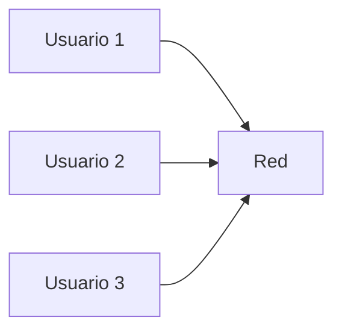
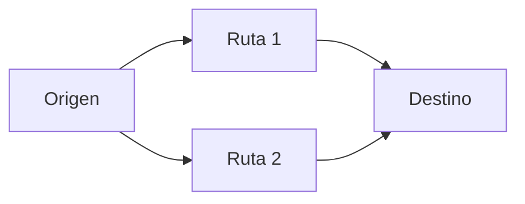

# ¿Por qué los datos se dividen en paquetes?

Hasta ahora hemos hablado de enviar datos como si fueran una sola unidad.

Pero en la práctica, eso no ocurre.

> Los datos no se envían completos. Se dividen en partes llamadas **paquetes**.
> 

---

## La idea clave

Un **paquete** es:

> una pequeña porción de datos que se envía de forma independiente a través de la red
> 

---

## ¿Por qué no enviar todo junto?

Imagina que quieres enviar un archivo muy grande.

Podrías:

- enviarlo completo en una sola transmisión
- o dividirlo en partes más pequeñas

Internet usa la segunda opción.

---

## Problema 1: Confiabilidad

Si envías todo en una sola pieza y algo falla:

- pierdes todo
- tienes que empezar desde cero

Pero si usas paquetes:

- solo se reenvían las partes que fallaron

---

## Problema 2: Uso eficiente de la red

Muchas personas usan la red al mismo tiempo.

Si un solo dispositivo enviara datos enormes sin dividir:

- bloquearía la red
- otros tendrían que esperar

Con paquetes:

- múltiples dispositivos pueden compartir la red

---

---

## Problema 3: Flexibilidad en el camino

Cuando los datos están divididos:

> cada paquete puede tomar diferentes rutas
> 

Esto permite:

- evitar congestión
- encontrar caminos más rápidos
- adaptarse a fallos en la red

---

---

## Problema 4: Control y orden

Cada paquete contiene información adicional que permite:

- saber de dónde viene
- saber a dónde va
- reconstruir el orden original

---

## Analogía importante

Imagina que quieres enviar un libro.

En lugar de mandar el libro completo:

- lo divides en páginas
- envías cada página en un sobre
- en el destino se reconstruye

Si una página se pierde, solo reenvías esa.

---

## Ejemplo real

Cuando envías un mensaje en WhatsApp:

- el mensaje se divide en paquetes
- los paquetes viajan por la red
- el receptor los reconstruye

---

## Intuición clave

Dividir datos en paquetes hace que la red sea:

- más eficiente
- más confiable
- más flexible

---

## Idea clave de esta lección

Los datos se dividen en paquetes para mejorar la confiabilidad, eficiencia y adaptabilidad de la comunicación en redes.

---

## Repaso

- Un paquete es una parte de los datos
- Evita tener que reenviar todo si hay errores
- Permite compartir la red entre múltiples usuarios
- Hace posible usar diferentes rutas
- Permite reconstruir la información en destino