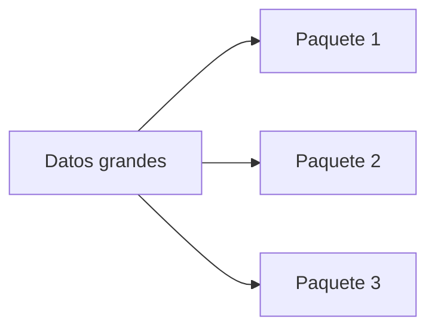
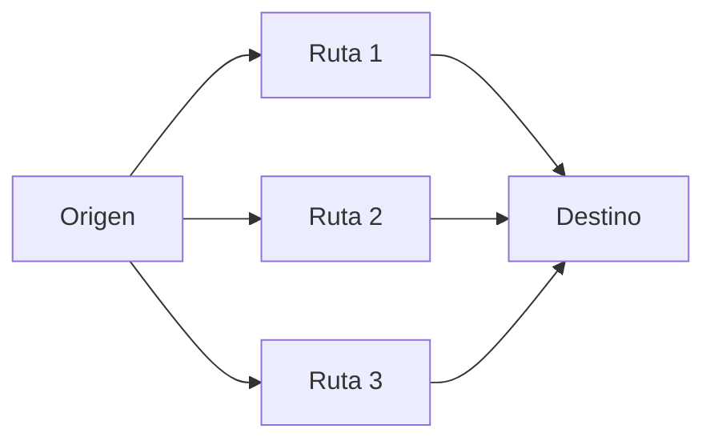
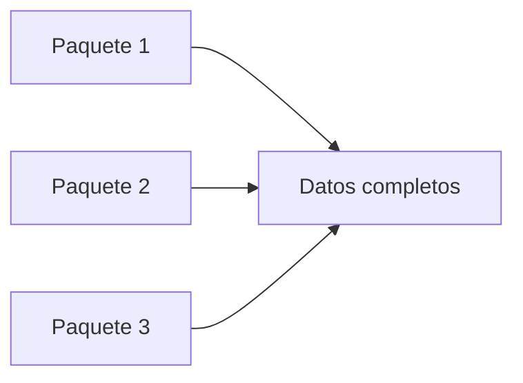

# Fragmentación y reensamblaje

> ¿Qué pasa cuando los datos son demasiado grandes para un solo paquete?
> 

---

## La idea clave

Cuando los datos son grandes:

> se dividen en múltiples paquetes más pequeños (fragmentación)
> 
> 
> y luego se reconstruyen en el destino (reensamblaje)
> 

---

## ¿Por qué es necesario fragmentar?

Las redes tienen límites en el tamaño de los paquetes.

Esto se debe a:

- restricciones del medio físico
- eficiencia en la transmisión
- compatibilidad entre redes

Por eso:

> los datos grandes deben dividirse antes de enviarse
> 

---

## Fragmentación

La **fragmentación** es el proceso de:

> dividir un conjunto de datos en múltiples paquetes más pequeños
> 

---

---

Cada paquete contiene:

- una parte de los datos
- información para identificar su posición

---

## Viaje independiente

Una característica importante:

> cada paquete puede viajar de forma independiente
> 

Esto significa que:

- pueden tomar rutas diferentes
- pueden llegar en distinto orden
- algunos pueden retrasarse

---

---

## Reensamblaje

Cuando los paquetes llegan al destino:

> se vuelven a unir para reconstruir los datos originales
> 

---

---

## ¿Cómo se mantiene el orden?

Cada paquete incluye información como:

- número de secuencia
- posición dentro del conjunto

Esto permite:

- ordenar correctamente los datos
- detectar si falta algún paquete

---

## ¿Qué pasa si falta un paquete?

Si uno no llega:

- se detecta la ausencia
- se solicita nuevamente
- el proceso se completa

---

## Analogía importante

Imagina que envías un rompecabezas:

- cada pieza es un paquete
- cada pieza tiene una posición
- aunque lleguen desordenadas, puedes armar la imagen

---

## Ejemplo real

Cuando ves un video en YouTube:

- el contenido se envía en múltiples paquetes
- los paquetes llegan continuamente
- el dispositivo los ensambla en tiempo real

---

## Intuición clave

La red no envía “archivos completos”.

> envía piezas que luego se reconstruyen
> 

---

## Idea clave de esta lección

La fragmentación divide los datos en paquetes más pequeños, y el reensamblaje los reconstruye correctamente en el destino.

---

## Repaso

- Los datos grandes se dividen en paquetes
- Cada paquete viaja de forma independiente
- Pueden llegar desordenados
- Se reensamblan usando información de control
- Si falta uno, se puede reenviar