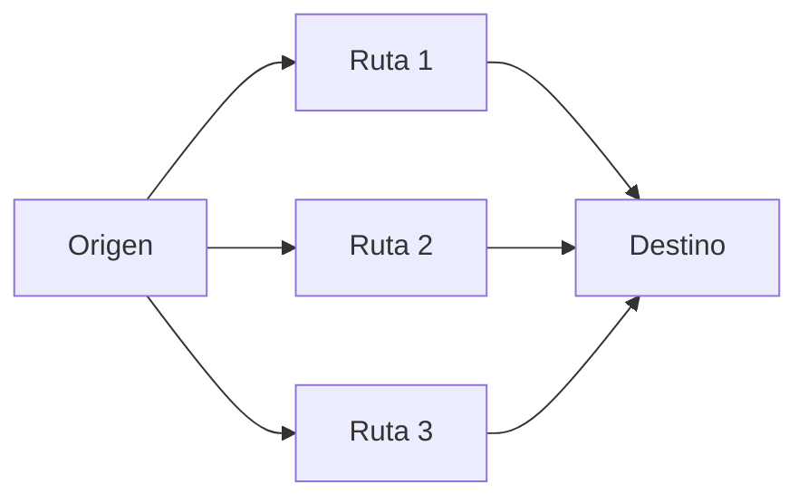
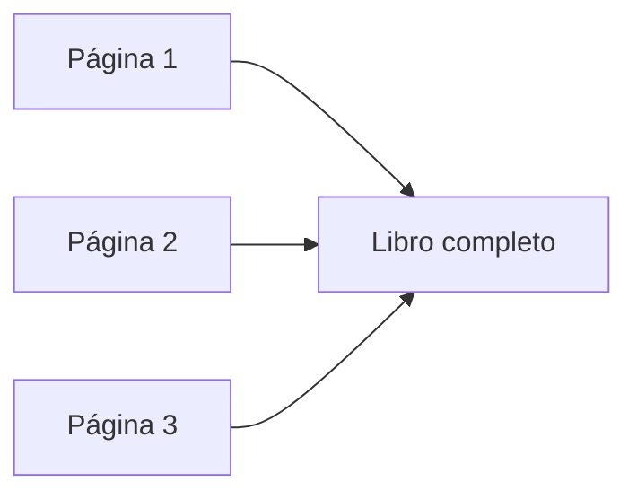

# Analogía: enviar un libro en sobres

Hasta ahora hemos visto conceptos importantes:

- paquetes
- fragmentación
- reensamblaje

Ahora vamos a integrarlos con una analogía sencilla.

---

## La situación

Imagina que quieres enviar un libro completo a otra persona.

Pero hay un problema:

> no puedes enviar todo el libro en un solo paquete
> 

---

## La solución

Decides dividir el libro:

- cada página en un sobre
- múltiples sobres enviados por separado

---

## Fragmentación

Esto es exactamente lo que hace la red.

Cada sobre contiene:

- una parte del libro
- información sobre su posición

---

## El “header” en la analogía

Cada sobre necesita una etiqueta.

Esa etiqueta incluye:

- dirección del destinatario
- dirección de origen
- número de página

Esto corresponde al **header** en redes.

---

## Envío independiente

Ahora envías todos los sobres.

Pero ocurre algo importante:

- algunos toman rutas diferentes
- algunos llegan antes
- otros se retrasan

---

---

## Llegada desordenada

Los sobres no llegan en orden:

- primero llega la página 3
- luego la página 1
- después la página 2

---

## Reensamblaje

La persona que recibe:

- revisa los números de página
- ordena correctamente
- reconstruye el libro

---

---

## ¿Qué pasa si falta un sobre?

Si una página no llega:

- se detecta que falta
- se solicita nuevamente
- el libro se completa

---

## Relación directa con redes

| Analogía | Redes |
| --- | --- |
| Libro | Datos completos |
| Sobres | Paquetes |
| Etiqueta | Header |
| Páginas | Fragmentos de datos |
| Ordenar páginas | Reensamblaje |
| Reenviar página | Retransmisión de paquetes |

---

## Intuición clave

La red no envía información completa de una sola vez.

> envía piezas independientes que luego se organizan
> 

---

## Idea clave de esta lección

Dividir datos en paquetes es como enviar un libro en sobres: permite flexibilidad, confiabilidad y reconstrucción correcta en el destino.

---

## Repaso

- Los datos se dividen como páginas de un libro
- Cada paquete lleva información de control
- Los paquetes viajan por rutas distintas
- Pueden llegar desordenados
- Se reensamblan en el destino