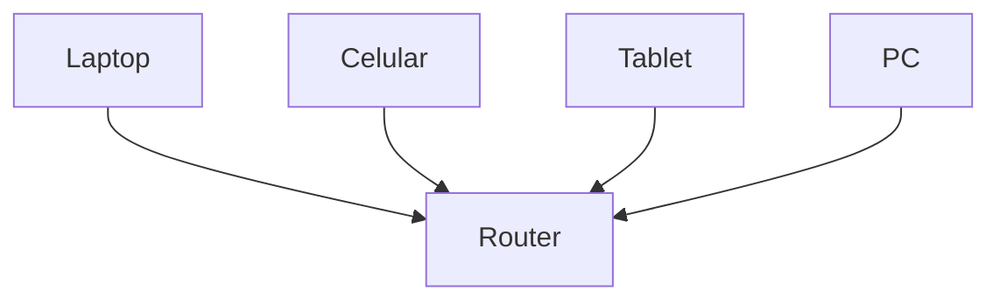

# ¿Qué es una red?

Cuando usamos Internet todos los días, rara vez pensamos en lo que realmente está pasando detrás.

Pero todo comienza con una idea muy simple:

> Una **red** es un conjunto de dispositivos conectados entre sí para intercambiar información.
> 

Nada más.

---

## Empecemos con algo familiar

Imagina que quieres hablar con un amigo.

Puedes hacerlo de varias formas:

- en persona
- por teléfono
- por mensaje

En todos los casos, hay algo en común:

existe una **conexión** que permite enviar información.

Ahora cambia personas por computadoras.

---

## Una red en su forma más simple

Si conectas dos computadoras y pueden enviarse datos, ya tienes una red.

No necesitas Internet.

No necesitas WiFi.

Solo necesitas conexión.

---

---

## ¿Qué cosas forman una red?

Toda red, sin importar su tamaño, tiene tres elementos fundamentales:

### 1. Dispositivos

Son los que participan en la comunicación.

Por ejemplo:

- computadoras
- celulares
- servidores

---

### 2. Medio de conexión

Es el camino por donde viajan los datos.

Puede ser:

- cables
- WiFi
- fibra óptica

---

### 3. Información

Es lo que se intercambia.

Por ejemplo:

- mensajes
- imágenes
- videos
- páginas web

---

## Una analogía importante

Una red funciona de forma muy similar a un sistema de correo.

- Los dispositivos son como casas
- La conexión son las calles
- La información son las cartas

Sin calles, no hay forma de enviar cartas.

Sin casas, no hay quién las reciba.

---

## De redes pequeñas a Internet

Una red puede ser muy pequeña, como:

- dos computadoras conectadas directamente

O más común, como la red de tu casa:

---

---

Pero también puede crecer muchísimo.

De hecho, Internet es simplemente:

> una red formada por muchas redes conectadas entre sí
> 

Por eso se le llama **la red de redes**.

---

## ¿Qué pasa en la vida real?

Cuando envías un mensaje por una app como WhatsApp, ocurre algo así:

1. Tu celular envía datos
2. Viajan por tu red (WiFi o datos móviles)
3. Pasan por múltiples redes en Internet
4. Llegan al dispositivo de otra persona

Todo eso ocurre gracias a redes interconectadas.

---

## Idea clave de esta lección

Una red no es solo cables o WiFi.

Es una **estructura que permite que dispositivos se comuniquen**.

Sin redes, no existirían:

- Internet
- aplicaciones
- servicios digitales

---

## Repaso

- Una red es un conjunto de dispositivos conectados
- Permite intercambiar información
- Tiene tres elementos clave:
    - dispositivos
    - conexión
    - datos
- Internet es una red de redes