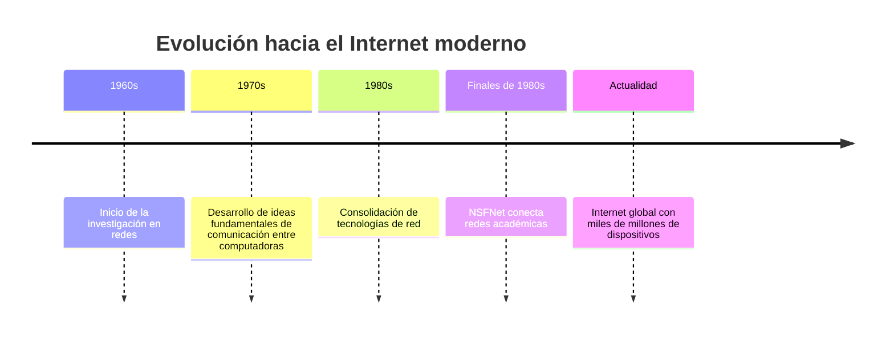
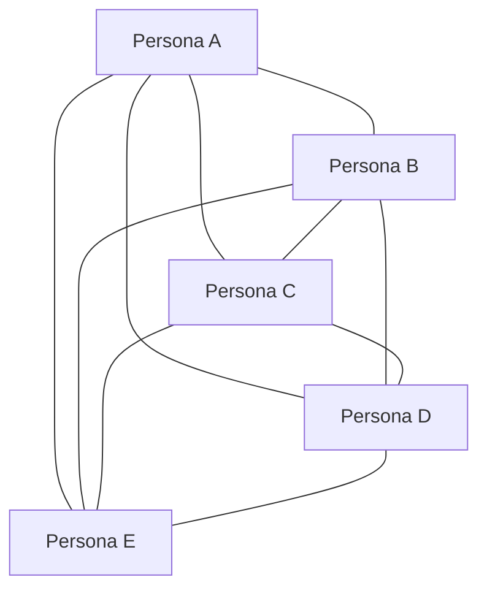
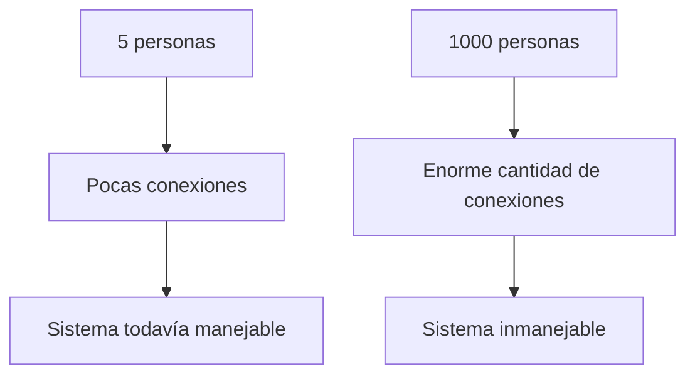
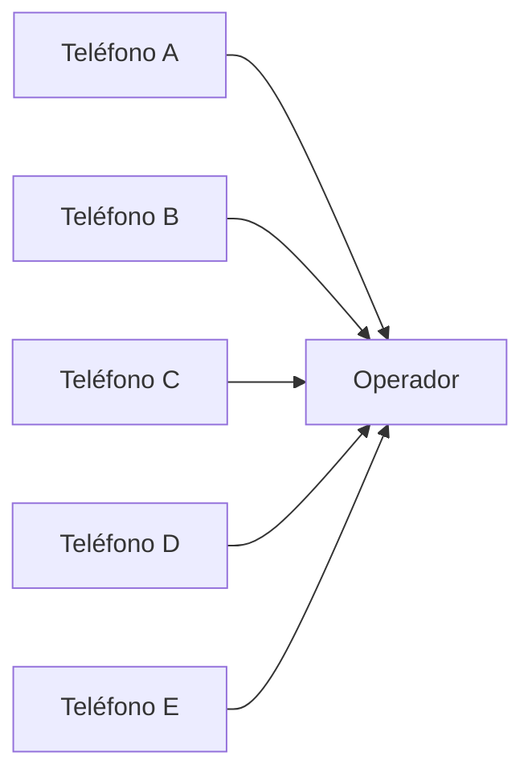
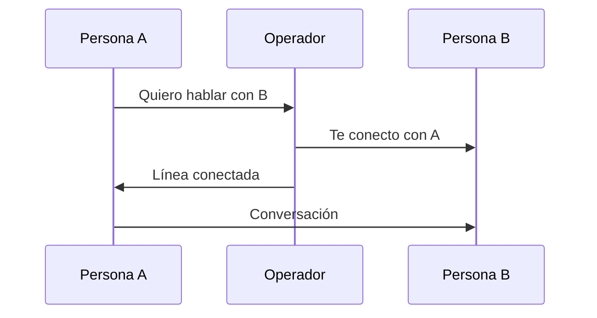
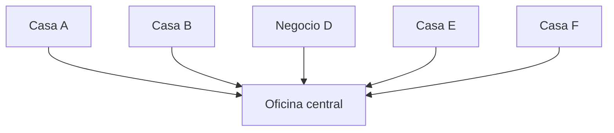
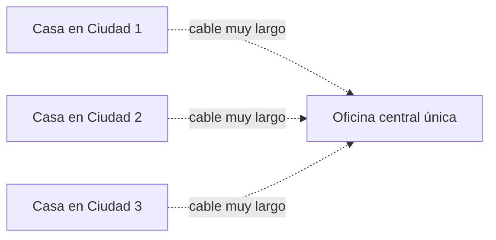
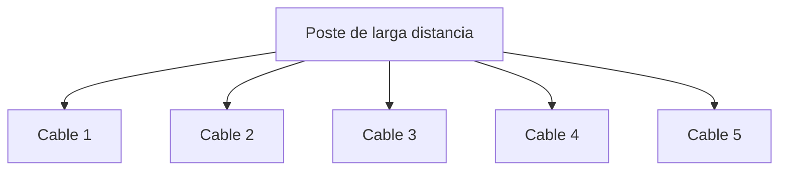
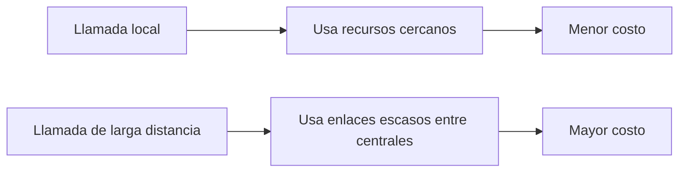
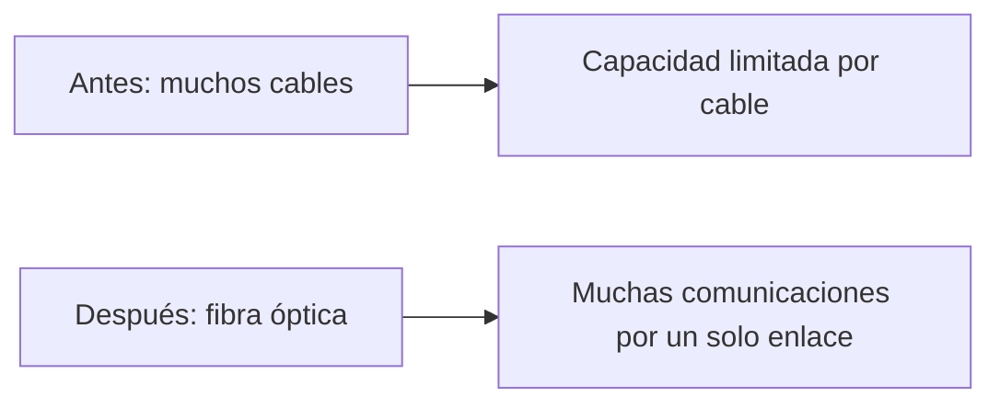

<iframe 
  width="560" 
  height="315" 
  src="https://youtu.be/KC6EliFkkIA?si=vx5UjLurgALOifQS" 
  title="Lección 1.1" 
  frameborder="0" 
  allow="accelerometer; autoplay; clipboard-write; encrypted-media; gyroscope; picture-in-picture" 
  allowfullscreen>
</iframe>

## La ilusión de simplicidad

### Idea clave

Usar Internet parece fácil, pero detrás hay una enorme complejidad técnica.

### Explicación

- Escribimos una dirección web y obtenemos una página.
- Abrimos una red social y vemos fotos, videos y mensajes casi al instante.
- Esa simplicidad visible depende de una gran cantidad de hardware y software funcionando en conjunto.

### Detrás de esa experiencia hay

- Cables
- Equipos de red
- Centros de datos
- Protocolos de comunicación
- Décadas de investigación

---

## Origen de Internet

### Idea clave

Internet no apareció de repente. Fue el resultado de muchos años de investigación en redes.

### Explicación

El diseño de las tecnologías que hacen posible el Internet actual comenzó en los años 60. Después de más de 20 años de trabajo, se construyeron redes suficientemente maduras para dar lugar a una primera versión funcional de Internet académico.

---

## Evolución constante

### Idea clave

Internet sigue cambiando porque las necesidades de comunicación también cambian.

### Hoy Internet es

- Más grande
- Más rápido
- Más distribuido
- Más complejo que nunca

### Consecuencia

La investigación en redes no terminó cuando nació Internet. Continúa hasta hoy para soportar:

- Más usuarios
- Más dispositivos
- Más velocidad
- Más cobertura global

---

# Comunicación a distancia

## Comunicación simple en un mismo espacio

### Escenario

Imagina cinco personas sentadas en círculo dentro de una misma habitación.

### Idea clave

Si todos están en el mismo lugar, comunicarse es relativamente sencillo.

### ¿Qué hace falta?

- Que puedan oírse
- Que respeten turnos
- Que no hablen todos al mismo tiempo

### Explicación

Aquí el medio compartido es el aire de la habitación. Todos pueden escuchar y participar, siempre que coordinen el uso de ese espacio común.

---

## El problema de la distancia

### Nuevo escenario

Ahora imagina que esas cinco personas están en habitaciones separadas.

### Problema

Ya no pueden:

- Verse
- Escucharse
- Coordinarse de forma natural

### Idea clave

Cuando aparece la distancia, la comunicación necesita un medio técnico.

### Explicación

La separación física rompe la comunicación directa. A partir de ese momento hay que inventar mecanismos para transportar la voz o la información de un lugar a otro.

---

## Conectar a todos directamente

### Solución inicial

Una posibilidad sería tender un cable entre cada pareja de personas, con micrófono en un extremo y altavoz en el otro.

### Idea clave

Funciona en teoría, pero se vuelve impráctico muy rápido.

### Problemas

- Cada persona necesita varias conexiones
- La cantidad de cables crece muchísimo
- Coordinar tantas conexiones se vuelve difícil

### Explicación

Con cinco personas ya es aparatoso. Con cientos o miles, el número de conexiones necesarias sería absurdo. Este es uno de los primeros grandes problemas de las redes: **la escalabilidad**.

---

## El problema de escalabilidad

### Idea clave

No todo sistema que funciona en pequeño funciona en grande.

### Explicación

La conexión directa entre todos los participantes no escala bien. Por eso, a medida que crecen los usuarios, se necesitan estructuras más inteligentes.

---

## La solución del operador central

### Idea clave

En vez de conectar a todos con todos, cada persona se conecta a un punto central.

### Ejemplo histórico

Los primeros sistemas telefónicos hacían exactamente eso.

### ¿Qué hacía el operador?

- Recibía una solicitud de llamada
- Conectaba manualmente dos líneas
- Desconectaba la llamada cuando terminaba

### Ventaja

- Cada persona necesita solo una conexión hacia el operador

### Desventaja

- El sistema depende de intervención humana
- Tiene límites de capacidad

---

## Redes telefónicas locales

### Idea clave

Cuando las distancias son cortas, una oficina central puede conectar a muchas casas o negocios cercanos.

### Explicación

Este modelo funcionaba bien en contextos locales porque era razonable tender un cable desde la oficina central hasta cada cliente cercano.

---

## El problema de larga distancia

### Problema

¿Qué pasa cuando las personas están separadas por cientos de kilómetros?

### Idea clave

No es viable tender un cable larguísimo desde cada casa hasta una sola oficina central.

### Explicación

Ese diseño sería demasiado costoso, difícil de mantener y poco eficiente.

---

## La solución: múltiples oficinas centrales

### Idea clave

En lugar de una sola central gigantesca, se construyen muchas oficinas centrales conectadas entre sí.

### Beneficio

- Cada usuario solo necesita conectarse a su central más cercana
- Las centrales se encargan de transportar la comunicación a mayor distancia

### Explicación

Aquí aparece una idea crucial para entender Internet: **la comunicación puede pasar por varios puntos intermedios antes de llegar a destino**.

---

## Capacidad limitada de los enlaces

### Idea clave

Antes de la fibra óptica, la capacidad de comunicación dependía mucho de la cantidad de cables físicos disponibles.

### Explicación

Cada cable representaba capacidad disponible para llamadas simultáneas. Si todos los cables estaban ocupados, no podían establecerse más llamadas en ese momento.

---

## Por qué la larga distancia era más cara

### Idea clave

Las llamadas largas ocupaban recursos costosos y escasos durante todo el tiempo de la conversación.

### Explicación

Mientras una llamada de larga distancia estaba activa, esos enlaces no podían ser usados por otras personas. Por eso se cobraba por minuto: el tiempo equivalía al uso continuo de un recurso limitado.

---

## La llegada de la fibra óptica

### Idea clave

La fibra óptica permitió transportar muchas conversaciones simultáneamente a través de un solo medio físico.

### Explicación

Con la fibra óptica, las redes ganaron muchísima más capacidad y eficiencia. Esto redujo varias limitaciones de los sistemas anteriores y permitió un crecimiento enorme en las comunicaciones.

---

## Idea fundamental para entender Internet

### Idea clave

Internet no consiste en que todos estén conectados directamente con todos.

### En realidad

Internet funciona porque:

- Existen nodos intermedios
- Se comparten enlaces
- La comunicación viaja por etapas
- La red está organizada para escalar

### Explicación

Esta es una de las intuiciones más importantes de todo el tema: la comunicación en red se resuelve con estructuras organizadas, no con conexiones directas entre cada par de participantes.

---

## Resumen

- La comunicación directa funciona solo en grupos pequeños
- La distancia introduce problemas técnicos
- Conectar a todos directamente no escala
- Las redes telefónicas resolvieron esto usando centrales
- Las comunicaciones de larga distancia requerían compartir enlaces costosos
- La fibra óptica aumentó drásticamente la capacidad
- Internet hereda esta lógica de nodos intermedios y recursos compartidos

---

Para entender Internet, primero hay que entender que comunicar a distancia nunca fue trivial. Lo que hoy parece instantáneo y natural es el resultado de muchos intentos por resolver problemas de distancia, coordinación, costo y escalabilidad.