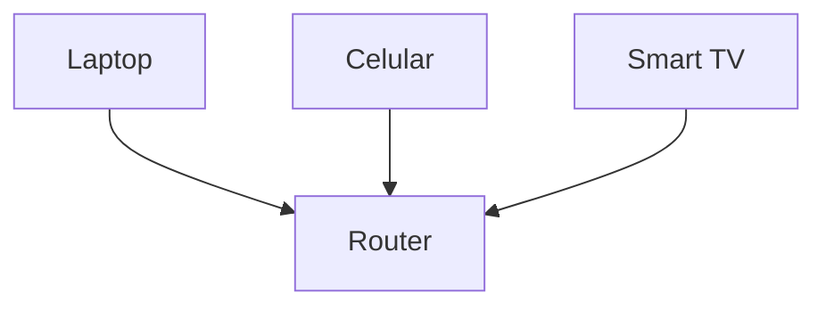
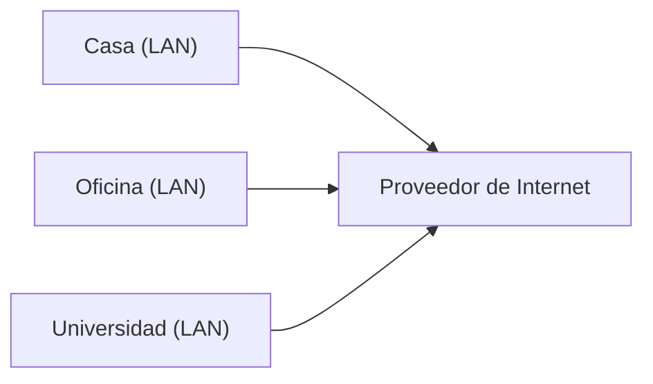
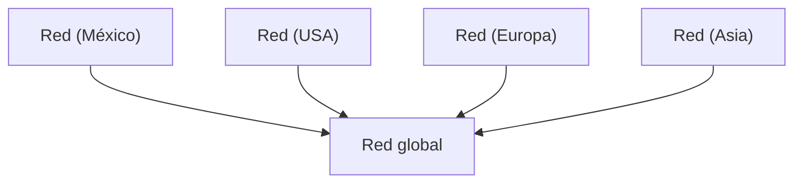

# Tipos de redes

En la lección anterior vimos que una red es simplemente dispositivos conectados para comunicarse.

Pero no todas las redes son iguales.

La diferencia principal entre ellas es **su tamaño y alcance**.

---

## La idea clave

Podemos clasificar las redes en tres grandes tipos:

- **LAN** (Local Area Network)
- **WAN** (Wide Area Network)
- **Internet** (la red global)

---

## LAN — Red de Área Local

Una **LAN** es una red pequeña que conecta dispositivos cercanos.

Por ejemplo:

- tu casa
- una oficina
- una escuela

---

---

### Características de una LAN

- Área pequeña
- Alta velocidad
- Controlada por una persona o empresa
- Generalmente usa WiFi o cable Ethernet

---

### Ejemplo real

Tu red WiFi en casa es una LAN.

Todos tus dispositivos están conectados al mismo router.

---

## WAN — Red de Área Amplia

Una **WAN** conecta múltiples redes LAN entre sí a grandes distancias.

---

---

### Características de una WAN

- Cubre grandes distancias (ciudades, países)
- Conecta muchas redes pequeñas
- Depende de proveedores de telecomunicaciones

---

### Ejemplo real

Cuando tu casa se conecta a Internet a través de tu proveedor, ya estás usando una WAN.

---

## Internet — La red de redes

Internet no es una sola red.

Es:

> una enorme red formada por miles de redes conectadas entre sí
> 

---

---

### Características de Internet

- Escala global
- No pertenece a una sola entidad
- Interconecta millones de dispositivos
- Permite servicios como web, correo, streaming

---

## Cómo se conectan todos

Lo importante no es memorizar definiciones, sino entender la relación:

1. Tu casa → **LAN**
2. Tu proveedor → conecta LANs → **WAN**
3. Todas las WANs conectadas → **Internet**

---

## Ejemplo

Cuando usas una app como WhatsApp:

1. Tu celular está en tu **LAN**
2. Tu router envía datos a tu proveedor (**WAN**)
3. Los datos viajan por Internet
4. Llegan a otra red en otra parte del mundo

---

Puedes pensar en esto como niveles:

- LAN = tu casa
- WAN = carreteras entre ciudades
- Internet = todo el sistema global conectado

---

Las redes se diferencian principalmente por su alcance.

- LAN → pequeña y local
- WAN → conecta múltiples LANs
- Internet → red global de redes

---

## Repaso

- Una LAN conecta dispositivos cercanos
- Una WAN conecta redes a gran escala
- Internet conecta todo
- Todas trabajan juntas constantemente