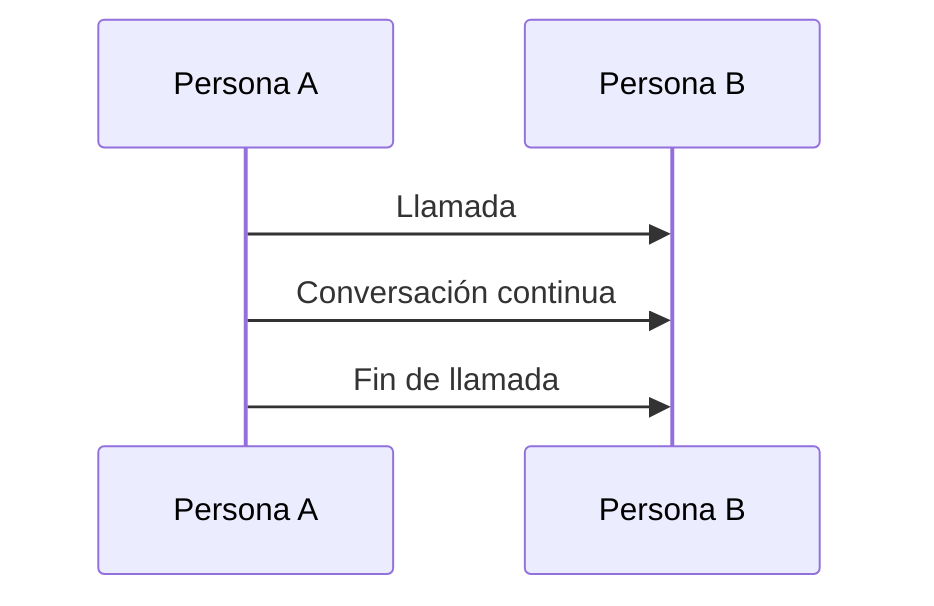
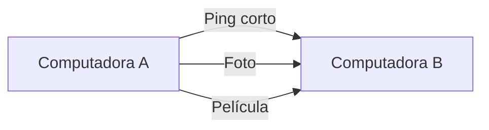
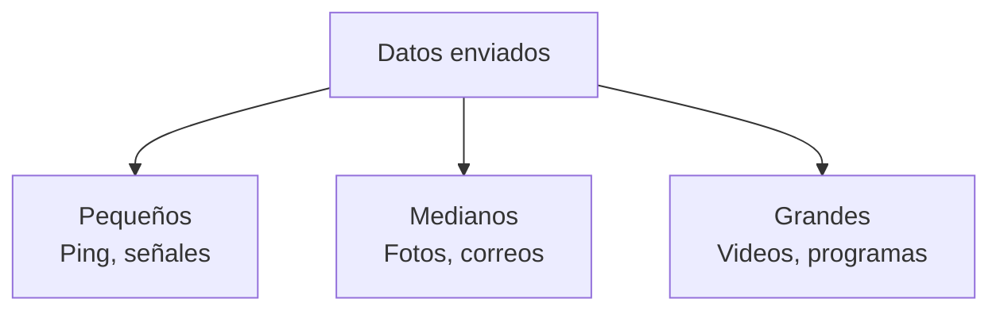
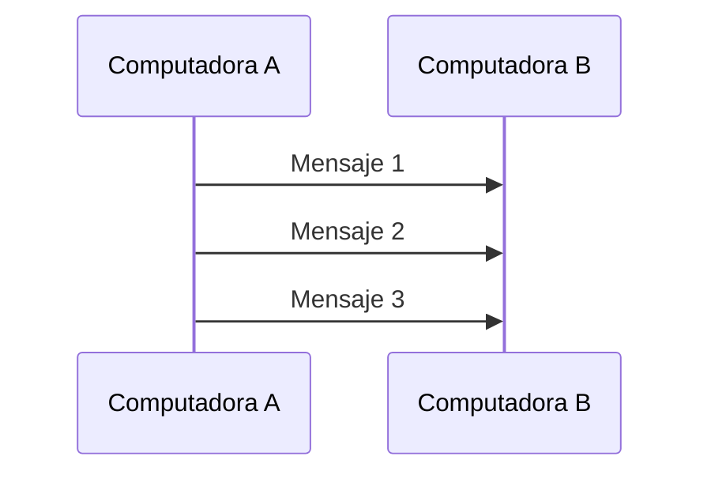
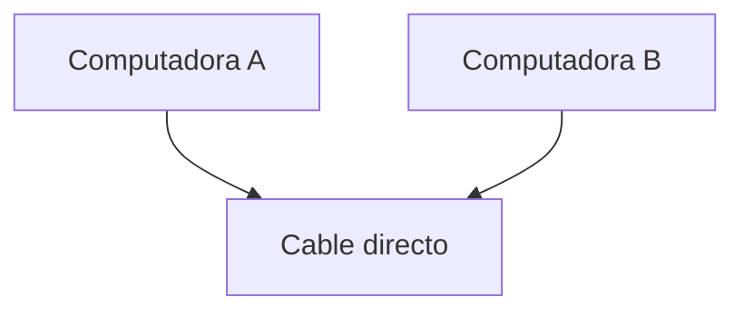
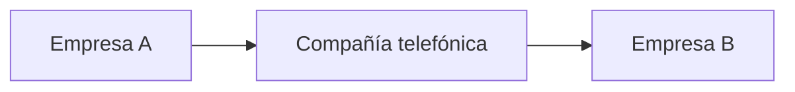
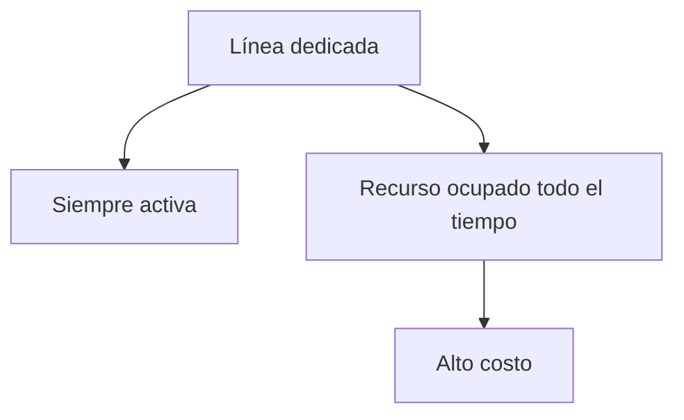
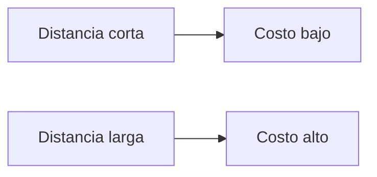

## Diferencia entre humanos y computadoras

### Idea clave

Las computadoras no se comunican como los humanos.

### Humanos

- Hacen una llamada
- Hablan durante un tiempo
- Terminan la comunicación

---

### Computadoras

- Envían datos constantemente
- No siguen un patrón fijo
- La comunicación puede ser:
    - Muy breve
    - Intermedia
    - Muy larga

---

## Tipos de comunicación entre computadoras

### Idea clave

No todos los mensajes son iguales.

### Tipos

- **Mensajes cortos**
    - Ej: verificar si un servidor está activo
- **Mensajes medianos**
    - Ej: enviar una imagen o correo
- **Mensajes largos**
    - Ej: descargar una película o software

---

## Primer modelo: conexión directa entre computadoras

### Idea clave

Las primeras computadoras se conectaban directamente entre sí.

### Características

- Conexión física (cables)
- Comunicación directa
- Sin intermediarios

---

## Envío de datos en cola

### Idea clave

Los datos se enviaban uno detrás de otro.

### Explicación

- Cada mensaje espera su turno
- No hay paralelismo
- El canal se usa de forma secuencial

---

## Flujo de transmisión

### Idea clave

Los mensajes no se mezclan: se envían en orden.

---

## Conexión en el mismo edificio

### Idea clave

Cuando las computadoras estaban cerca, era fácil conectarlas.

### Características

- Bajo costo
- Control total del propietario
- Instalación sencilla

---

## Conexión dentro de una ciudad

### Problema

No siempre puedes tender tu propio cable.

### Solución

Usar infraestructura de compañías telefónicas.

### Idea clave

Se empieza a depender de terceros.

---

## Líneas arrendadas (leased lines)

### Idea clave

Conexiones dedicadas entre computadoras.

### Características

- Siempre activas
- No requieren “marcar”
- Comunicación inmediata

---

## Ventajas y desventajas

### Ventajas

- Conexión estable
- Baja latencia
- Siempre disponible

### Desventajas

- Muy costosas
- Se usan incluso cuando no hay tráfico

---

## Conexiones de larga distancia

### Idea clave

Las líneas arrendadas también se extendían entre ciudades.

### Problema

- Pocos cables disponibles
- Costos muy altos
- Escalabilidad limitada

---

## El costo de la distancia

### Explicación

- Más distancia = más infraestructura
- Más infraestructura = mayor costo

---

## Problema de compatibilidad

### Idea clave

No todas las computadoras hablaban el mismo “idioma”.

### Explicación

- Cada fabricante tenía su propio sistema
- No había estándares universales
- La comunicación solo funcionaba entre sistemas compatibles

---

## Resumen

- Las computadoras envían datos de forma continua y variable
- Los mensajes pueden ser de distintos tamaños
- El envío se hacía en cola, de forma secuencial
- Las conexiones directas funcionaban, pero no escalaban
- Las líneas dedicadas resolvían algunos problemas, pero eran costosas
- La falta de estándares limitaba la comunicación entre diferentes sistemas