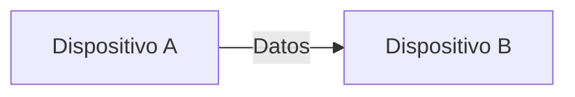
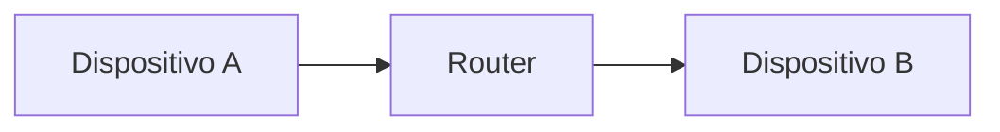
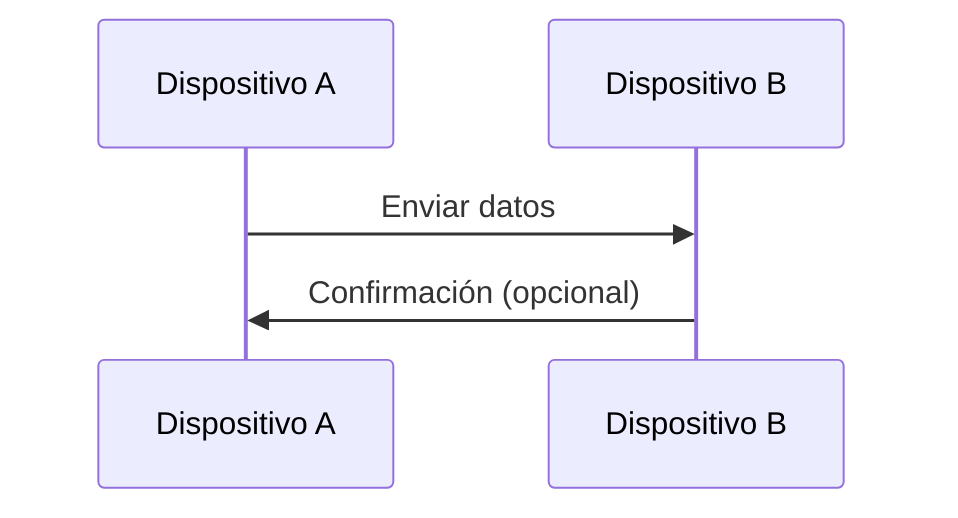

# ¿Cómo se comunican dos dispositivos?

En la lección anterior vimos qué es una red y sus tipos.

Ahora vamos a responder una pregunta fundamental:

> ¿Qué tiene que pasar para que dos dispositivos realmente se comuniquen?
> 

---

## La idea básica

Para que dos dispositivos se comuniquen, necesitan tres cosas:

- saber **a quién enviar la información**
- tener un **camino disponible**
- usar un **lenguaje común**

---

## Paso 1: Identificar al destino

Antes de enviar cualquier dato, un dispositivo necesita saber a quién enviarlo.

En redes, cada dispositivo tiene una forma de identificarse (más adelante veremos las direcciones IP).

Por ahora, basta con entender:

> cada dispositivo tiene una “dirección” única dentro de la red
> 

---

## Paso 2: Establecer un camino

Una vez que se conoce el destino, los datos necesitan un camino para viajar.

Ese camino puede ser:

- un cable
- una red WiFi
- múltiples redes interconectadas

---

---

En redes más reales, el camino incluye intermediarios:

---

## Paso 3: Usar un lenguaje común

No basta con enviar datos.

Ambos dispositivos deben entender cómo están organizados.

Ese “lenguaje” son las reglas de comunicación, llamadas **protocolos**.

Por ejemplo:

- cómo empieza un mensaje
- cómo termina
- cómo se confirma que llegó

Más adelante veremos esto con detalle.

---

## El proceso completo 

Podemos resumir la comunicación así:

1. Un dispositivo genera información
2. Identifica al destino
3. Envía los datos a través de la red
4. El otro dispositivo recibe los datos
5. Interpreta la información

---

---

## Ejemplo

Cuando envías un mensaje en una aplicación como WhatsApp:

1. Tu celular crea el mensaje
2. Identifica al destinatario
3. Envía los datos a través de la red
4. El dispositivo del otro usuario recibe el mensaje
5. La aplicación lo muestra en pantalla

---

## Algo importante: no siempre es directo

En la práctica, los dispositivos casi nunca están conectados directamente.

La comunicación suele pasar por varios intermediarios:

- routers
- servidores
- redes externas

Esto significa que el mensaje puede viajar por múltiples pasos antes de llegar.

---

La comunicación en redes no es magia.

Es simplemente:

> enviar datos estructurados desde un origen hasta un destino a través de un camino definido
> 

---

Para que dos dispositivos se comuniquen, necesitan:

- una forma de identificarse
- un medio de conexión
- reglas compartidas

---

## Repaso

- Cada dispositivo tiene una identidad dentro de la red
- Los datos viajan a través de un camino (directo o indirecto)
- La comunicación sigue reglas llamadas protocolos
- El proceso incluye envío, recepción e interpretación