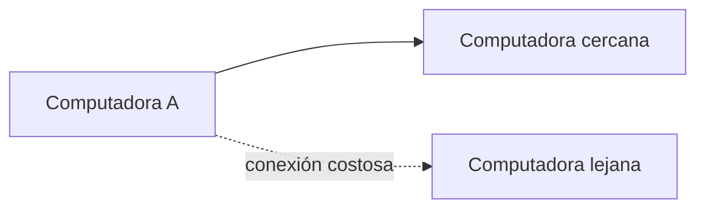
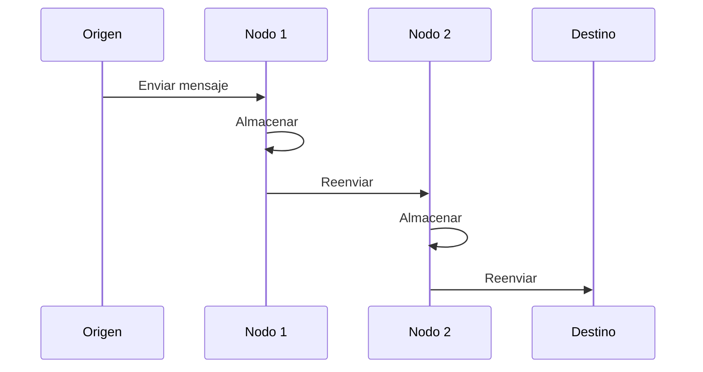
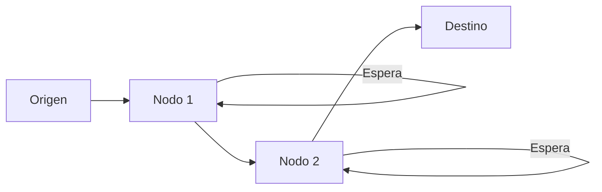
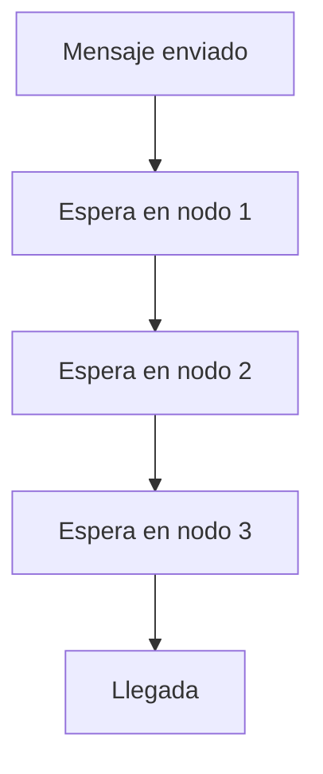
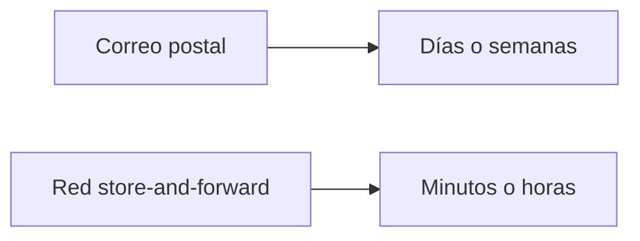
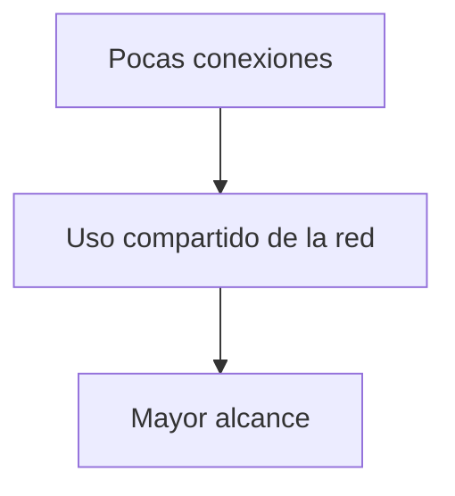
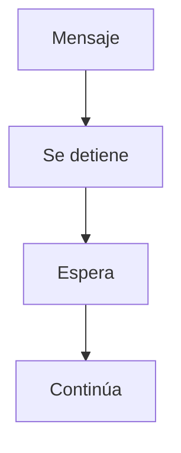

## El problema de la distancia en redes tempranas

### Idea clave

Las computadoras solo estaban conectadas a equipos cercanos debido al alto costo de las conexiones.

### Explicación

- En los años 70 y 80, las conexiones eran costosas
- Mientras más distancia, mayor el costo
- Las computadoras no podían conectarse directamente a sistemas lejanos

---

## La idea clave: usar intermediarios

### Idea clave

Un mensaje podía viajar largas distancias pasando por múltiples computadoras intermedias.

### Explicación

- Si A está conectado a B
- Y B está conectado a C
- Y C está conectado a D

> Entonces A puede enviar un mensaje a D a través de la cadena

---

## Concepto de almacenamiento y reenvío

### Idea clave

Cada computadora intermedia recibe el mensaje, lo guarda temporalmente y luego lo reenvía.

### Explicación

- El mensaje no viaja de forma continua
- Se detiene en cada punto intermedio
- Cada nodo decide cuándo enviarlo al siguiente

---

## Flujo completo de un mensaje

### Idea clave

El mensaje avanza paso a paso, no todo de una vez.

---

## Esperas en cada salto (hop)

### Idea clave

El mensaje puede quedarse esperando en cada nodo antes de continuar.

### Explicación

- Cada nodo tiene una cola de mensajes
- El mensaje espera su turno
- El tiempo depende del tráfico

---

## Concepto de "salto" (hop)

### Idea clave

Cada vez que un mensaje pasa de una computadora a otra, ocurre un “salto”.

### Explicación

- Más distancia = más saltos
- Más saltos = más tiempo total

---

## Tiempo de entrega

### Idea clave

El tiempo total dependía de la suma de esperas en cada nodo.

### Explicación

- Podía tardar:
    - Minutos
    - Horas
    - Incluso días
- Todo dependía del tráfico en la red

---

## Comparación con métodos tradicionales

### Idea clave

Aunque lento, este sistema era más eficiente que el correo físico.

### Explicación

- Incluso con retrasos, era más rápido que enviar cartas
- Permitía comunicación digital a larga distancia por primera vez

---

## Ventaja clave del modelo

### Idea clave

Permite comunicación global usando pocas conexiones físicas.

### Explicación

- No necesitas conectar todo con todo
- Se reutilizan enlaces existentes
- La red crece de forma más eficiente

---

## Desventaja principal

### Idea clave

La comunicación no es inmediata.

### Explicación

- No hay transmisión en tiempo real
- El mensaje viaja “por etapas”
- Puede haber grandes retrasos

---

## Insight clave (muy importante)

Aquí nace uno de los conceptos fundamentales de Internet:

> Los datos pueden viajar en partes, pasando por múltiples nodos, sin necesidad de conexión directa.

---

## Resumen

- Las computadoras estaban conectadas solo a equipos cercanos
- Los mensajes viajaban a través de múltiples nodos intermedios
- Cada nodo almacenaba y reenviaba el mensaje
- El tiempo dependía del tráfico en cada salto
- Este modelo permitió comunicación a larga distancia con pocas conexiones
- Fue una base fundamental para el desarrollo de Internet