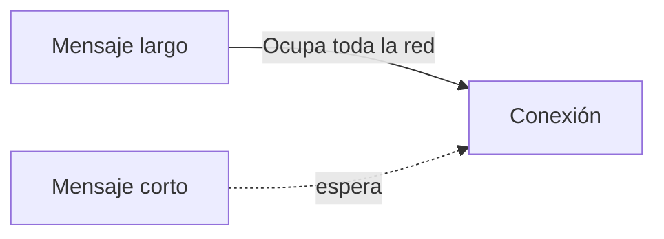
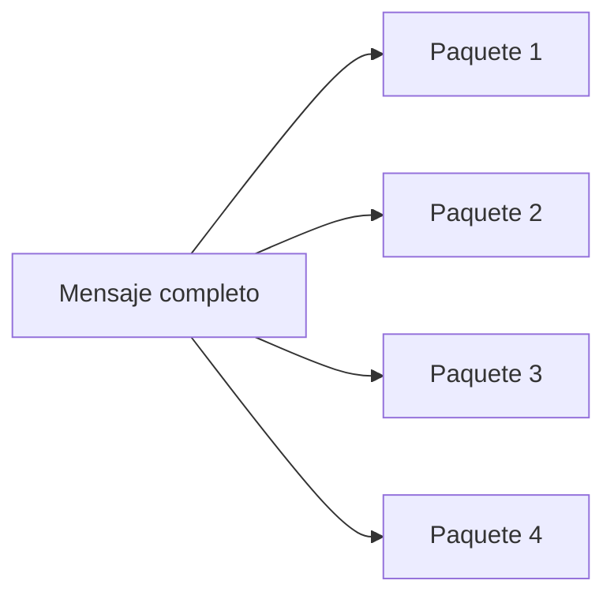
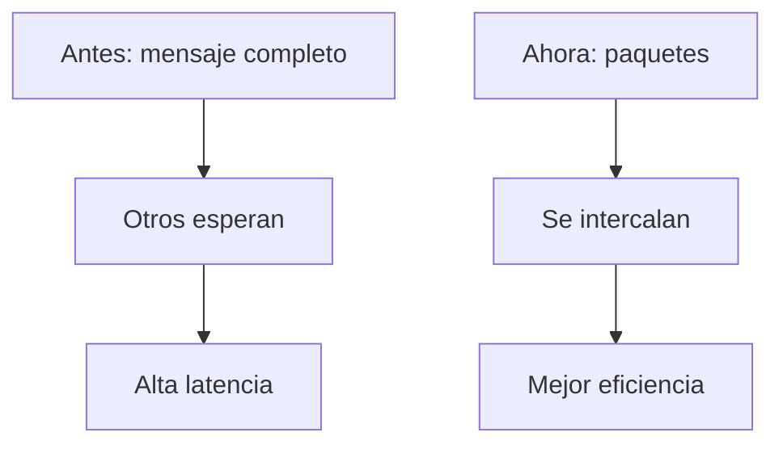
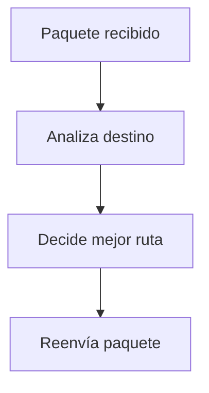
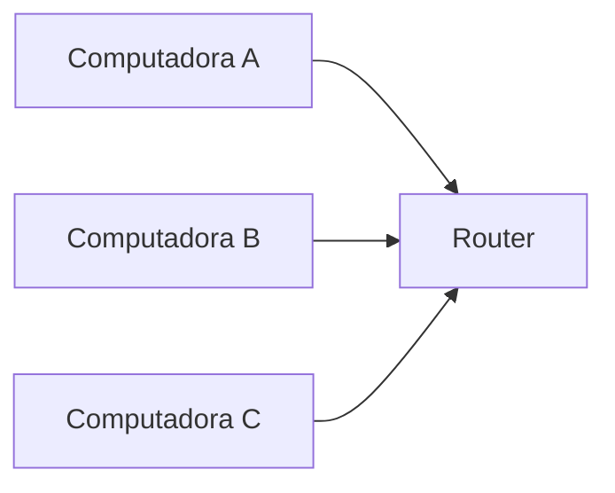
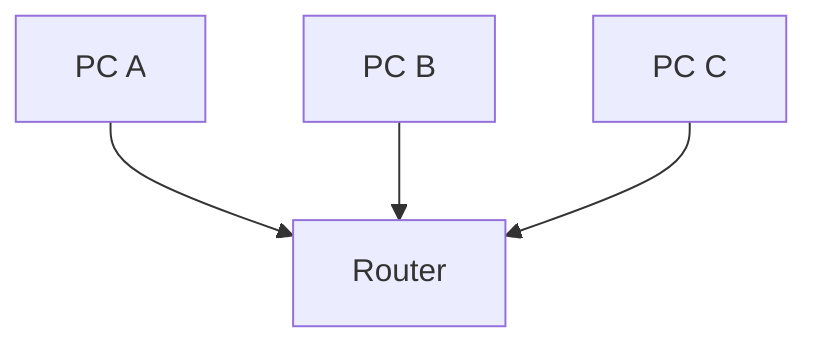

## El problema del modelo anterior

### Idea clave

Enviar mensajes completos era ineficiente y lento.

### Explicación

- Un mensaje largo ocupaba toda la conexión
- Otros mensajes debían esperar
- Se generaban grandes retrasos

---

## La innovación: dividir en paquetes

### Idea clave

Los mensajes se dividen en fragmentos pequeños llamados paquetes.

### Explicación

- Cada paquete se envía por separado
- No es necesario esperar a enviar todo el mensaje completo
- Permite mayor flexibilidad en la red

---

## Envío intercalado de paquetes

### Idea clave

Los paquetes de distintos mensajes pueden alternarse en la red.

### Explicación

- Un mensaje corto no tiene que esperar a que termine uno largo
- Solo espera al paquete actual en transmisión
- Mejora el tiempo de respuesta

---

## Comparación: antes vs ahora

### Idea clave

Dividir en paquetes hace la red mucho más eficiente.

---

## Menor necesidad de almacenamiento

### Idea clave

Los nodos intermedios ya no necesitan almacenar mensajes completos.

### Explicación

- Antes: guardar mensajes por horas
- Ahora: guardar paquetes por segundos
- Reduce carga en la red

---

## Evolución: aparición de equipos especializados

### Idea clave

Se crearon dispositivos dedicados a mover paquetes en la red.

### Primer nombre

- **IMPs (Interface Message Processors)**

### Función

- Interconectar computadoras
- Gestionar el envío de paquetes

---

## Nacimiento de los routers

### Idea clave

Los IMP evolucionaron a routers.

### Función del router

- Recibir paquetes
- Decidir a dónde enviarlos
- Encaminarlos hacia su destino

---

## Qué hace un router realmente

### Idea clave

El router actúa como un “director de tráfico” de la red.

---

## Interoperabilidad entre computadoras

### Idea clave

Los routers permiten conectar computadoras de diferentes fabricantes.

### Explicación

- Ya no importa cómo se comunican internamente
- El router maneja la comunicación externa
- Se facilita la estandarización

---

## Redes de Área Local (LAN)

### Idea clave

Una LAN conecta dispositivos en una misma ubicación.

### Características

- Misma ubicación física
- Alta velocidad
- Bajo costo

---

## Redes de Área Amplia (WAN)

### Idea clave

Una WAN conecta múltiples redes locales entre sí.

### Explicación

- Permite comunicación entre ciudades o países
- Usa múltiples routers intermedios

---

## Conexión LAN → WAN

### Idea clave

El router conecta redes locales con redes globales.

### Explicación

- El router es la puerta de salida
- Permite que dispositivos locales accedan a redes externas

---

## Insight clave (muy importante)

Dividir datos en paquetes + usar routers permite:

- Escalabilidad
- Eficiencia
- Interoperabilidad

> Esta es la base del Internet moderno

---

## Resumen

- Los mensajes se dividen en paquetes
- Los paquetes se envían de forma independiente
- Se pueden intercalar paquetes de distintos mensajes
- Se reduce el almacenamiento en nodos intermedios
- Aparecen dispositivos especializados: routers
- Los routers dirigen los paquetes hacia su destino
- Se facilita la conexión entre diferentes sistemas
- Las LAN se conectan a WAN mediante routers