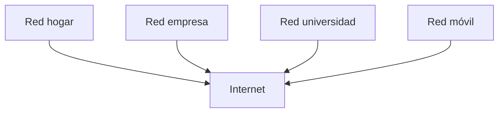
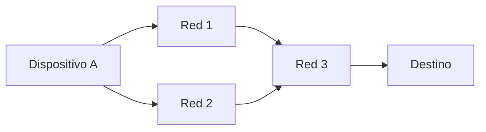

# ¿Qué hace diferente a Internet?

Hasta ahora hemos visto qué es una red y cómo se comunican los dispositivos.

Pero Internet no es simplemente “otra red más”.

> Internet es una infraestructura global que conecta millones de redes independientes.
> 

---

## No es una sola red

Una idea importante:

Internet no pertenece a una sola empresa, ni a un solo país.

Está formado por:

- redes de casas
- redes de empresas
- redes de universidades
- redes de proveedores

Todas conectadas entre sí.

---

---

## Entonces, ¿cómo funciona si nadie lo controla?

Aquí está la clave.

Internet funciona porque todos siguen las mismas reglas.

Estas reglas son:

> estándares abiertos
> 

---

## Estándares abiertos

Los estándares abiertos son acuerdos sobre cómo deben comunicarse los dispositivos.

Definen cosas como:

- cómo se envían los datos
- cómo se identifican los dispositivos
- cómo se organiza la información

Lo importante es que:

- cualquiera puede usarlos
- no pertenecen a una empresa
- permiten que sistemas distintos funcionen juntos

---

## Interoperabilidad

Gracias a estos estándares, ocurre algo fundamental:

> dispositivos muy diferentes pueden comunicarse sin problemas
> 

Por ejemplo:

- un celular puede hablar con un servidor
- una app puede funcionar en distintos sistemas
- redes de distintos países pueden conectarse

A esto se le llama **interoperabilidad**.

---

## Descentralización

Otra característica clave de Internet:

> no tiene un centro único
> 

Esto significa:

- no hay un punto único de control
- no hay un punto único de falla
- múltiples caminos pueden existir entre dos dispositivos

---

---

Si una parte falla, los datos pueden tomar otro camino.

---

## Escala global

Internet es enorme.

Conecta:

- millones de redes
- miles de millones de dispositivos

Y aun así, funciona de manera coordinada.

---

## Ejemplo real

Cuando usas una aplicación como YouTube:

- tu dispositivo está en una red local
- esa red se conecta a tu proveedor
- los datos cruzan múltiples redes
- llegan a servidores en otra parte del mundo

Todo esto ocurre sin que tengas que pensar en ello.

---

Internet no es especial por su tecnología.

Es especial porque:

> permite que redes independientes funcionen juntas como un solo sistema
> 

---

Internet es diferente porque:

- conecta redes, no solo dispositivos
- usa estándares abiertos
- es descentralizado
- funciona a escala global

---

## Repaso

- Internet es una red de redes
- No pertenece a una sola entidad
- Funciona gracias a reglas compartidas
- Permite interoperabilidad entre sistemas
- No tiene un centro único