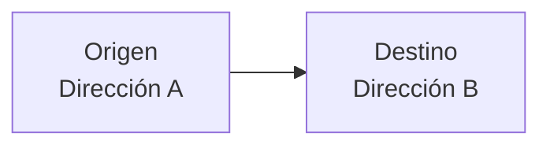
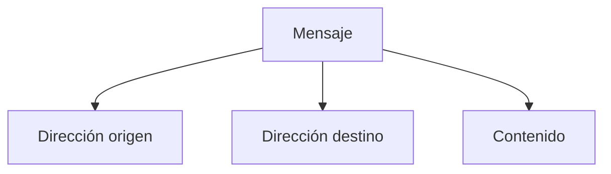
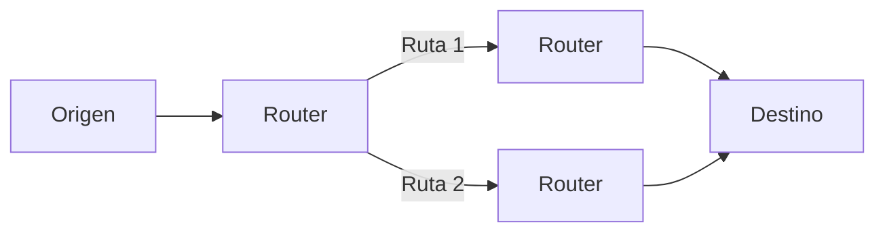
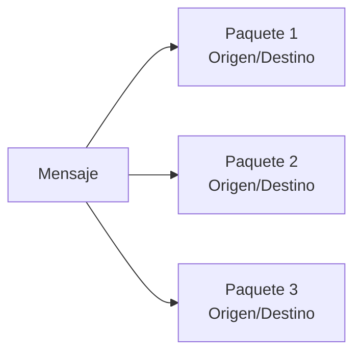
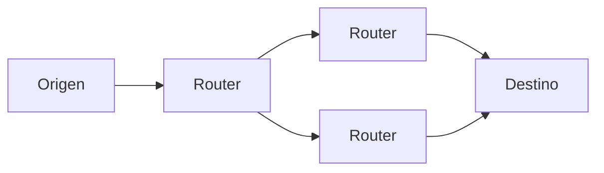
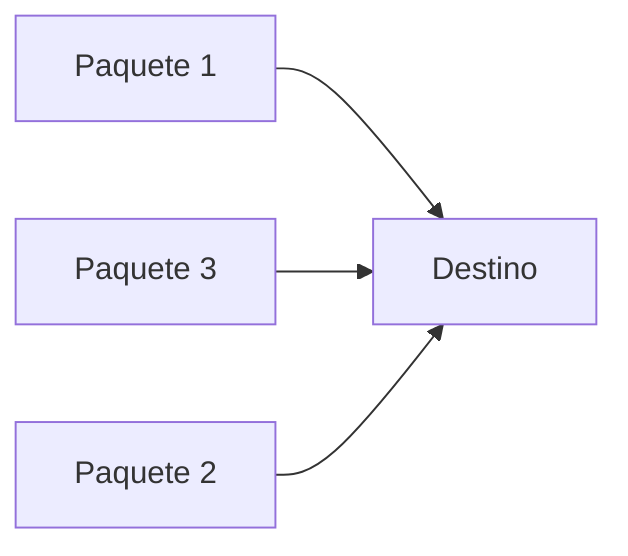
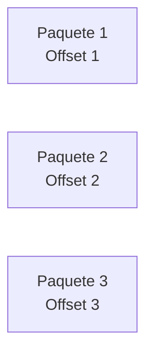
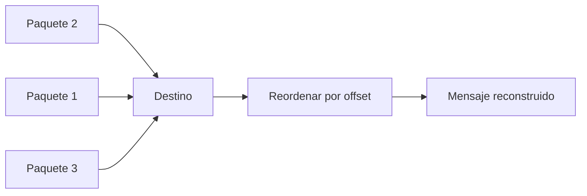
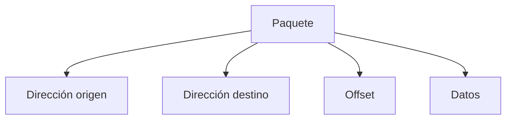

## La necesidad de direcciones

### Idea clave

Para enviar un mensaje, es necesario saber quién lo envía y quién lo recibe.

### Explicación

- Cada computadora tiene un identificador único
- Este identificador funciona como una “dirección”
- Permite distinguir entre millones de dispositivos

---

## Direcciones en los mensajes

### Idea clave

Cada mensaje incluye información de origen y destino.

### Explicación

- Antes de enviarse, el mensaje se “etiqueta”
- Esto permite que la red sepa hacia dónde enviarlo

---

## Elección de rutas

### Idea clave

Los nodos intermedios pueden elegir diferentes caminos según el destino.

### Explicación

- Puede haber múltiples rutas disponibles
- Los routers eligen la mejor opción
- La decisión depende del estado de la red

---

## Direcciones en paquetes

### Idea clave

Cuando un mensaje se divide, cada paquete necesita su propia dirección.

### Explicación

- Cada paquete viaja de forma independiente
- Cada uno debe saber a dónde ir
- No dependen de otros paquetes para moverse

---

## Viaje independiente de paquetes

### Idea clave

Los paquetes pueden tomar rutas diferentes.

### Explicación

- No todos los paquetes siguen el mismo camino
- La red optimiza cada envío
- Aumenta la eficiencia y resiliencia

---

## Problema: orden de llegada

### Idea clave

Los paquetes pueden llegar en desorden.

### Explicación

- Diferentes rutas → diferentes tiempos
- No llegan necesariamente en orden

---

## Solución: offset (posición)

### Idea clave

Cada paquete incluye su posición dentro del mensaje original.

### Explicación

- El “offset” indica el orden correcto
- Permite reconstruir el mensaje original

---

## Reconstrucción del mensaje

### Idea clave

El destino reorganiza los paquetes antes de usarlos.

---

## Estructura de un paquete

### Idea clave

Un paquete contiene más que solo datos.

### Explicación

Cada paquete incluye:

- Quién lo envía
- A quién va dirigido
- Su posición
- Parte del contenido

---

## Insight clave (muy importante)

### Idea clave

El direccionamiento permite que la red funcione sin rutas fijas.

- Los paquetes pueden viajar por diferentes caminos
- Los routers toman decisiones dinámicas
- El destino reconstruye el mensaje final

> Esta flexibilidad es fundamental para Internet

---

## Resumen

- Cada computadora tiene una dirección única
- Los mensajes incluyen origen y destino
- Los paquetes también llevan direcciones
- Los routers usan estas direcciones para enrutar
- Los paquetes pueden tomar diferentes rutas
- Pueden llegar en desorden
- El offset permite reconstruir el mensaje correctamente