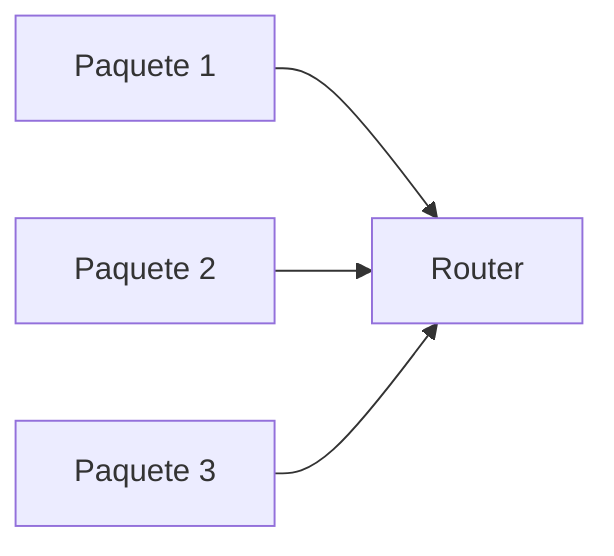
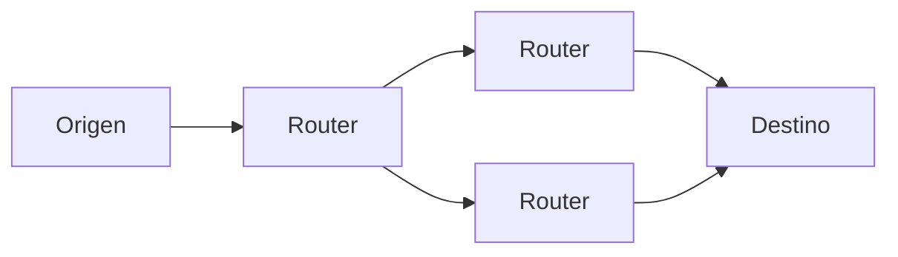
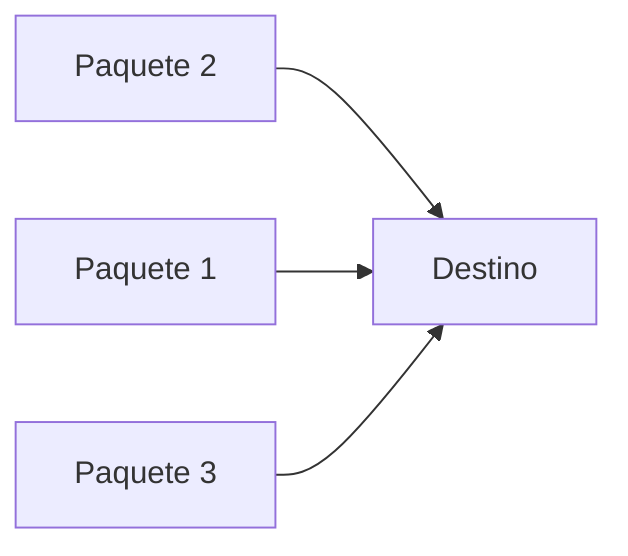
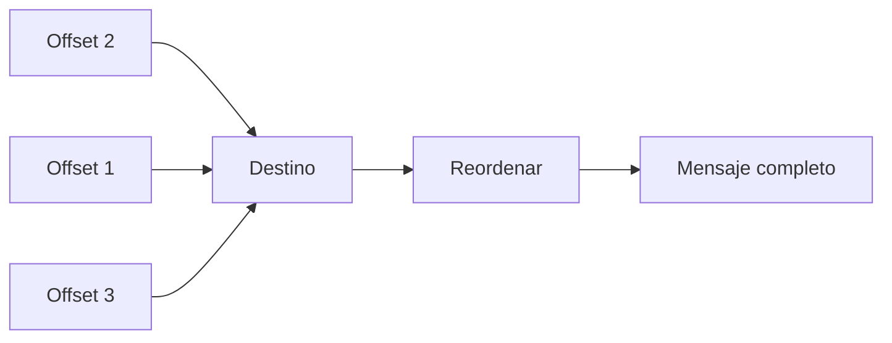
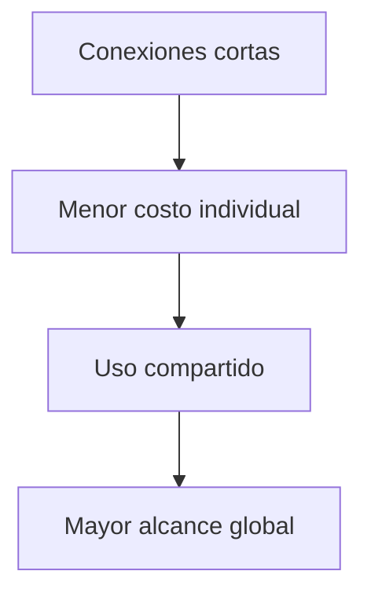
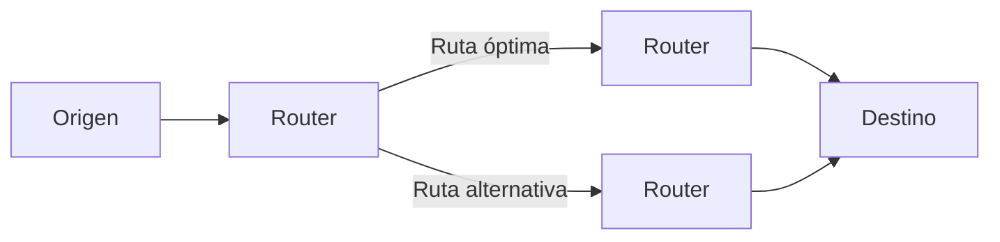
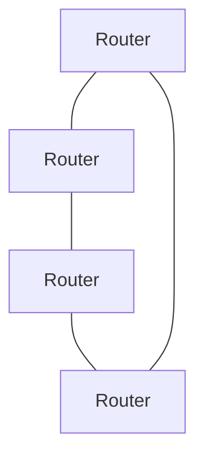
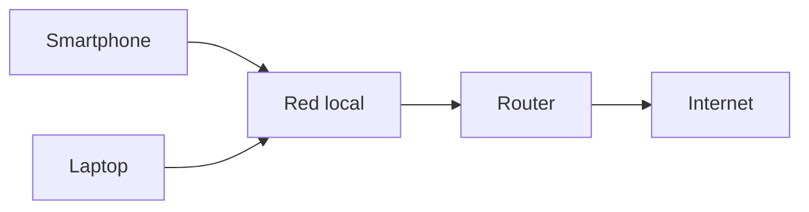
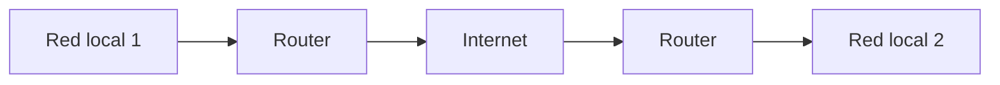

## La visión completa

### Idea clave

Internet funciona gracias a routers que envían paquetes a través de múltiples saltos.

### Explicación

- Los datos no viajan directamente
- Pasan por varios routers intermedios
- Cada salto acerca el paquete a su destino

---

## Paquetes viajan de forma independiente

### Idea clave

Cada paquete es tratado como una unidad independiente.

### Explicación

- No existe un “mensaje completo” en tránsito
- Solo paquetes individuales moviéndose en la red
- Cada uno se enruta por separado

---

## Diferentes rutas para un mismo mensaje

### Idea clave

Los paquetes de un mismo mensaje pueden tomar caminos distintos.

### Explicación

- La red decide dinámicamente
- No hay una única ruta fija
- Se optimiza el tráfico en tiempo real

---

## Llegada desordenada

### Idea clave

Los paquetes pueden llegar en diferente orden al que fueron enviados.

### Explicación

- Diferentes rutas implican diferentes tiempos
- Puede haber congestión en algunos caminos
- El orden no está garantizado

---

## Reconstrucción del mensaje

### Idea clave

El destino usa el offset para reconstruir el mensaje original.

### Explicación

- Cada paquete tiene su posición
- El sistema reorganiza los datos
- Se reconstruye el mensaje correctamente

---

## Uso eficiente de la red

### Idea clave

Dividir en múltiples saltos reduce costos y mejora eficiencia.

### Explicación

- No se necesitan conexiones directas largas
- Se reutilizan enlaces existentes
- El costo se distribuye entre muchos usuarios

---

## Adaptación dinámica de rutas

### Idea clave

Los routers pueden cambiar rutas si hay congestión o fallos.

### Explicación

- Si un camino está saturado, se usa otro
- La red se adapta automáticamente
- Mejora la resiliencia

---

## El núcleo de Internet

### Idea clave

Internet es una red de routers que cooperan.

### Explicación

- No hay un único centro
- Muchos routers trabajan juntos
- Manejan tráfico de múltiples orígenes y destinos

---

## Conexión de dispositivos a Internet

### Idea clave

Cada dispositivo se conecta a través de una red local y un router.

### Explicación

- Los dispositivos no se conectan directamente a todo Internet
- Usan una red local como intermediario
- El router conecta esa red al resto del mundo

---

## Internet = red de redes

### Idea clave

Internet conecta múltiples redes locales entre sí.

### Explicación

- Cada red local es independiente
- Internet las interconecta
- Permite comunicación global

---

## Insight clave (muy importante)

Internet no es una sola red, es una interconexión de muchas redes.

- Los paquetes viajan por múltiples routers
- Las rutas son dinámicas
- Los mensajes se reconstruyen al final
- Todo funciona de manera distribuida

> Esta arquitectura hace posible la escala global de Internet

---

## Resumen

- Los routers dirigen paquetes entre origen y destino
- Los paquetes viajan de forma independiente
- Pueden tomar diferentes rutas
- Pueden llegar en desorden
- El destino reconstruye el mensaje usando el offset
- La red optimiza rutas dinámicamente
- Internet es una red de routers interconectados
- Los dispositivos acceden a Internet a través de redes locales