## Evolución del problema

### Idea clave

Internet no fue diseñado originalmente para ser seguro.

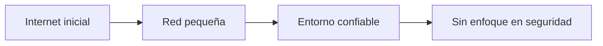

---

## Cambio con el crecimiento

### Idea clave

La seguridad se volvió crítica cuando Internet creció.

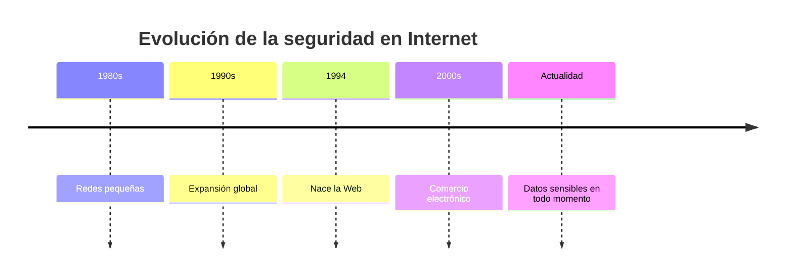

---

## Problema de seguridad

### Idea clave

Los datos viajan por medios inseguros.

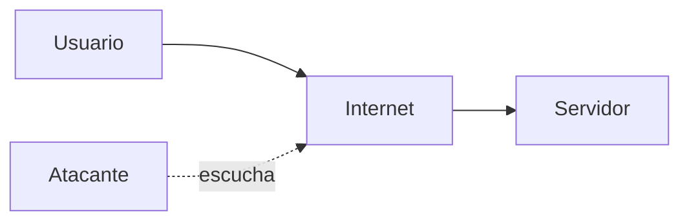

---

## Métodos para proteger datos

### Enfoque 1: Seguridad física

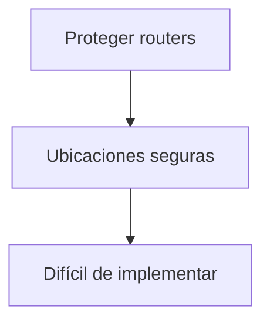

### Problema

- Muchas redes
- Muchos operadores
- WiFi rompe el modelo

---

## Problema con WiFi

### Idea clave

En redes inalámbricas, cualquiera puede escuchar.

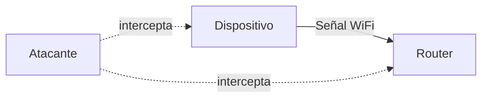

---

## Solución real

### Idea clave

Encriptar los datos antes de enviarlos.

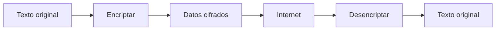

---

## Qué logra la encriptación

### Beneficios

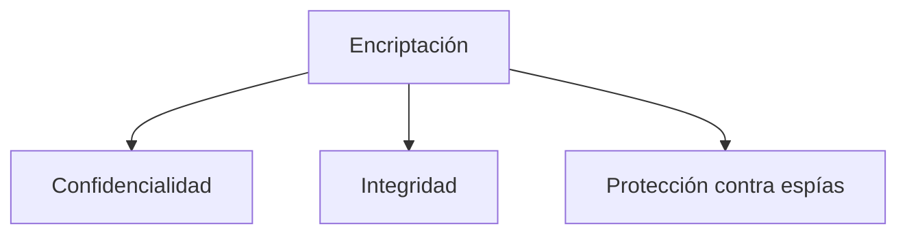

---

## Conceptos clave

### Definiciones

- **Texto plano**: mensaje original
- **Texto cifrado**: mensaje codificado
- **Encriptar**: convertir a cifrado
- **Desencriptar**: recuperar original

---

## Ejemplo histórico: Cifrado César

### Idea clave

Uno de los primeros métodos de encriptación.

---

## Ejemplo práctico

### Transformación

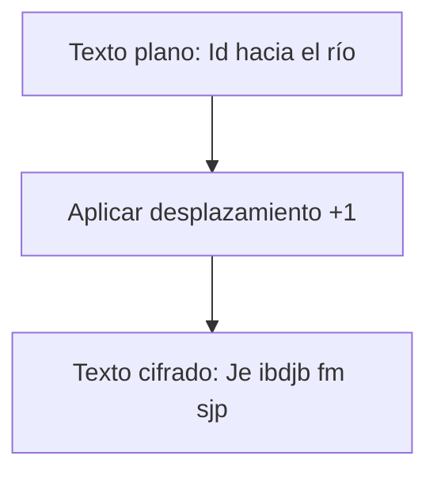

---

## Flujo de comunicación segura

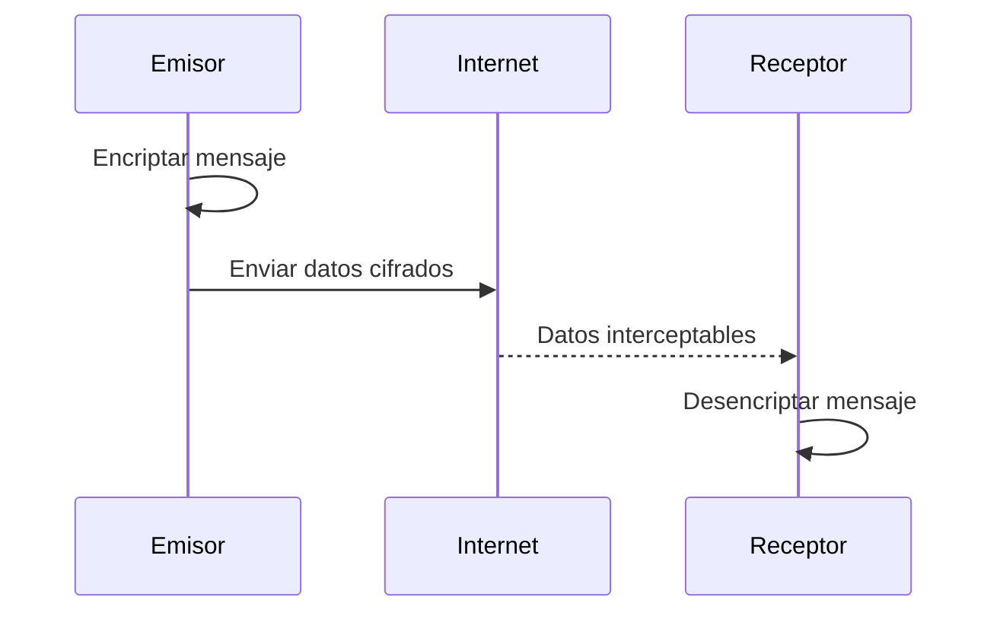

---

## Problema del cifrado simple

### Idea clave

Los métodos simples son fáciles de romper.

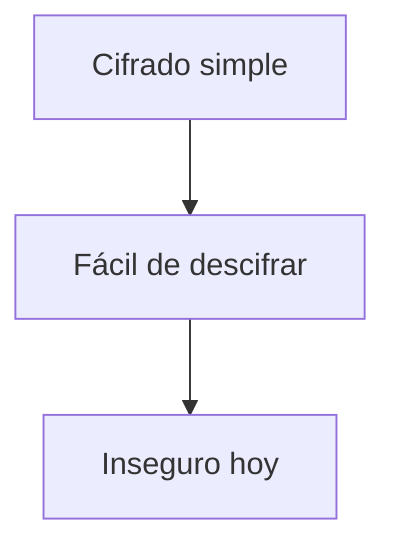

---

## Encriptación moderna

### Idea clave

Se basa en claves secretas.

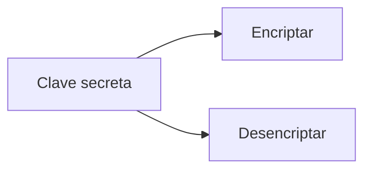

---

## Insight clave

Hoy asumimos que la red es insegura.

- Cualquiera puede ver los paquetes
- La seguridad depende de la encriptación
- No del medio físico

---

## Resumen

- Internet no fue diseñado inicialmente con seguridad
- El crecimiento hizo necesaria la protección de datos
- No es viable proteger toda la infraestructura
- En redes inalámbricas, los datos pueden ser interceptados
- La solución es encriptar los datos antes de enviarlos
- El receptor desencripta para recuperar el mensaje
- El cifrado usa claves secretas
- Métodos simples como el Cifrado César ya no son seguros