## Idea general

### Idea clave

Existen dos formas principales de proteger datos con secretos.

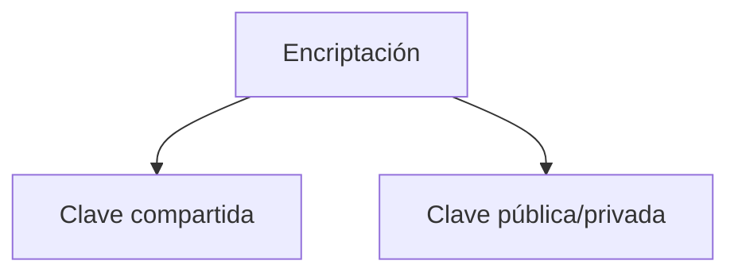

---

## Método tradicional

### Idea clave

Usar un secreto compartido entre emisor y receptor.

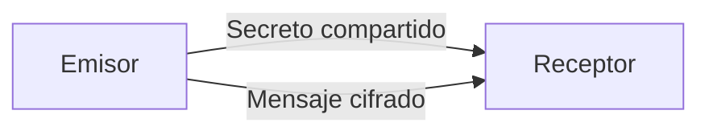

---

## Problema del secreto compartido

### Idea clave

No escala en Internet.

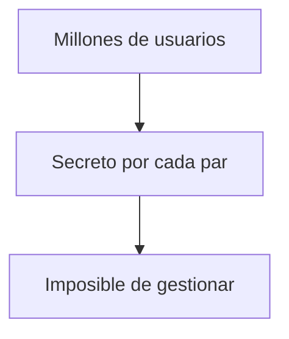

---

## Ejemplo del mundo real

### Idea clave

Antes se compartían secretos manualmente.

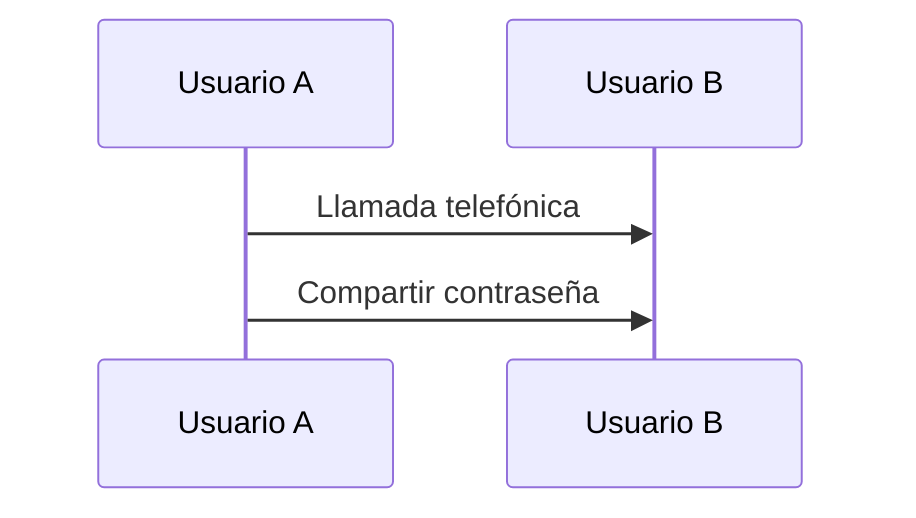

---

## Problema crítico

### Idea clave

Si el secreto viaja por la red, puede ser interceptado.

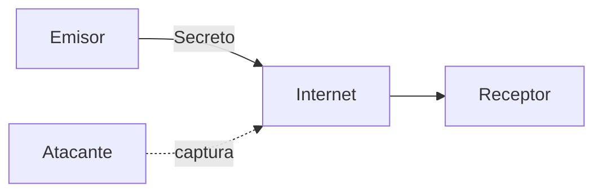

---

## Ataque posible

### Idea clave

Un atacante puede modificar mensajes.

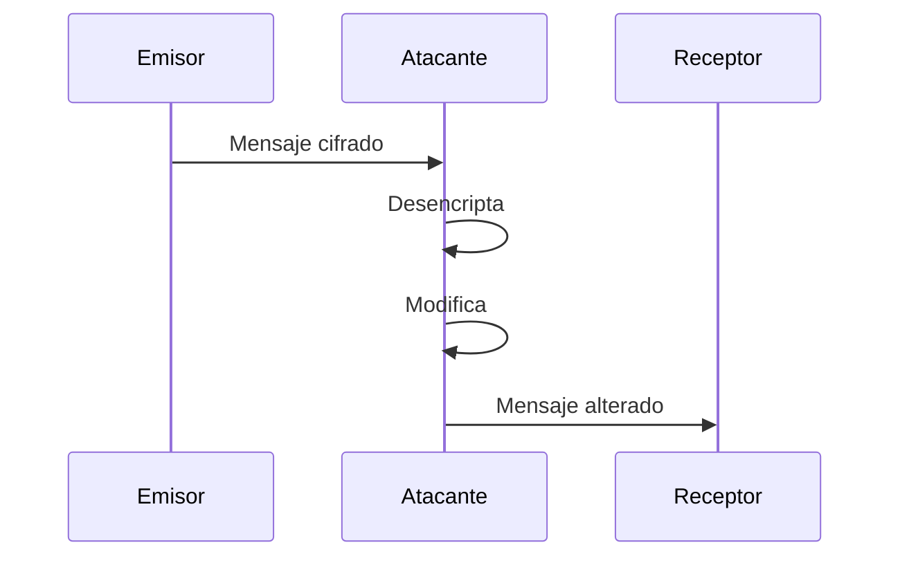

---

## Conclusión del problema

### Idea clave

El secreto compartido no es viable a gran escala.

- Difícil de distribuir
- Fácil de interceptar
- Vulnerable a ataques

---

## Solución: cifrado asimétrico

### Idea clave

Usar dos claves diferentes.

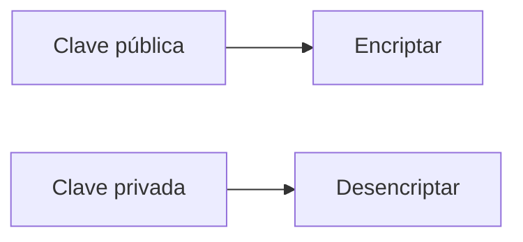

---

## Funcionamiento

### Paso a paso

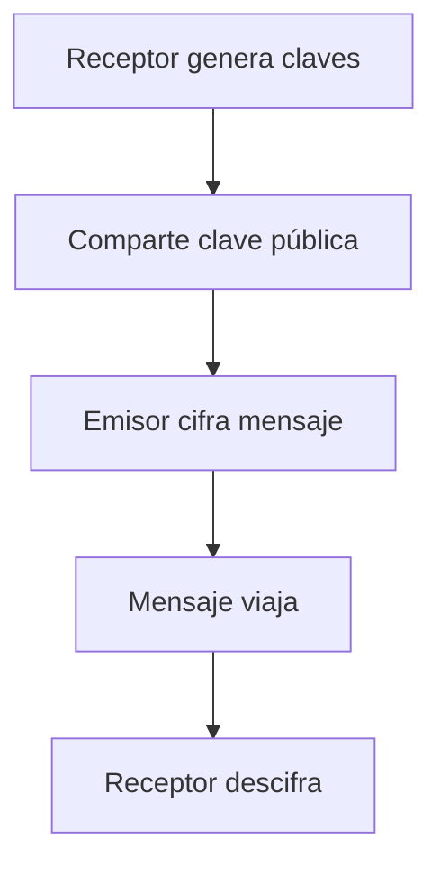

---

## Flujo completo

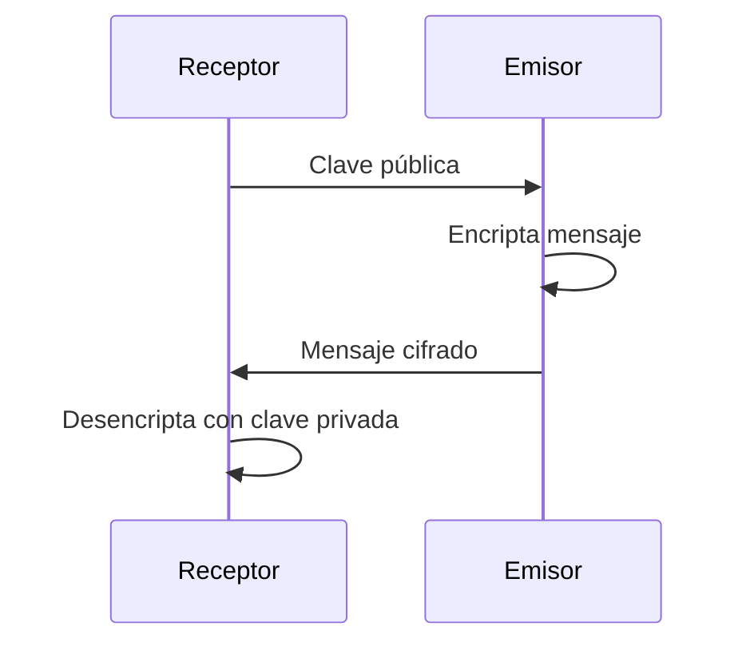

---

## Diferencia clave

### Idea clave

Una clave se comparte, la otra no.

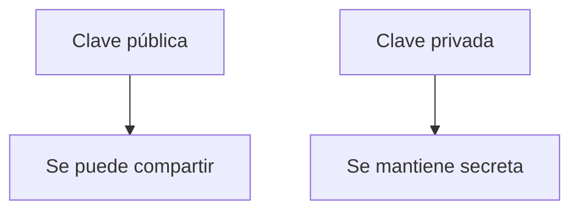

---

## Seguridad del sistema

### Idea clave

No puedes obtener la clave privada fácilmente.

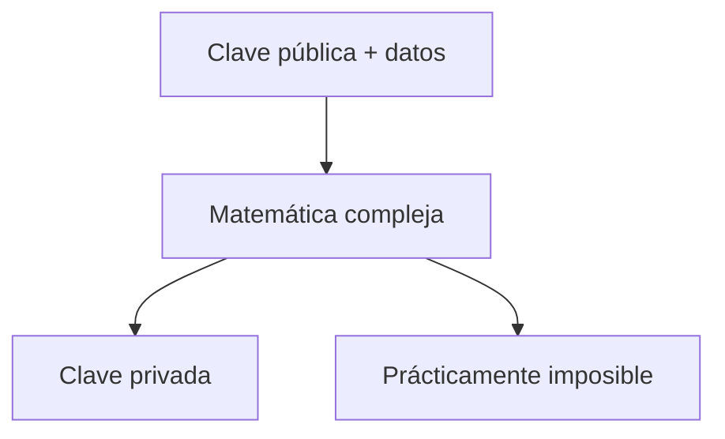

---

## Beneficio principal

### Idea clave

Permite comunicación segura sin compartir secretos previamente.

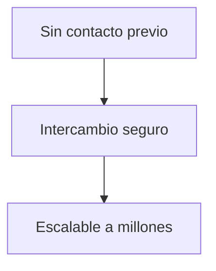

---

## Insight clave

La clave pública resolvió el problema de Internet.

- No necesitas confiar en la red
- No necesitas compartir secretos previamente
- Escala globalmente

---

## Resumen

- El cifrado tradicional usa un secreto compartido
- Este método no escala en Internet
- Compartir secretos por red es inseguro
- Los atacantes pueden interceptar y modificar mensajes
- El cifrado asimétrico usa dos claves
- La clave pública se comparte
- La clave privada se mantiene secreta
- Es prácticamente imposible derivar la clave privada
- Este modelo permite comunicación segura global