## Problema inicial

### Idea clave

Internet ya estaba construido cuando surgió la necesidad de seguridad.

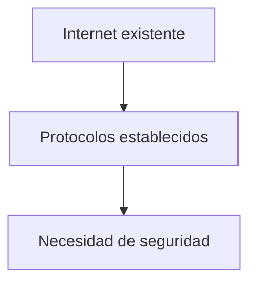

---

## Restricción importante

### Idea clave

No se podían cambiar los protocolos existentes.

- Routers ya desplegados
- Infraestructura global
- Millones de dispositivos

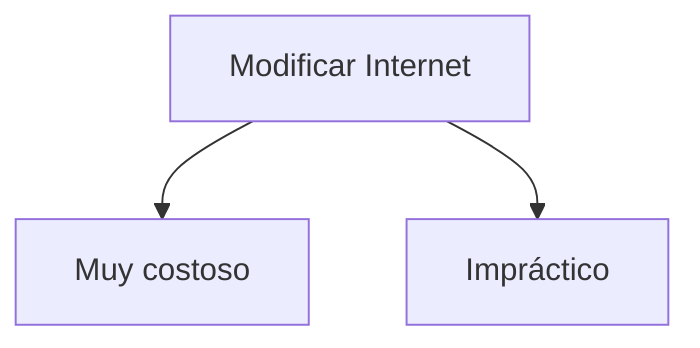

---

## Solución clave

### Idea clave

Agregar una nueva capa sin romper lo existente.

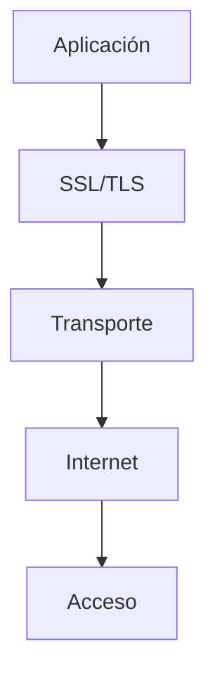

---

## Posición en la arquitectura

### Idea clave

SSL/TLS se ubica entre Aplicación y Transporte.

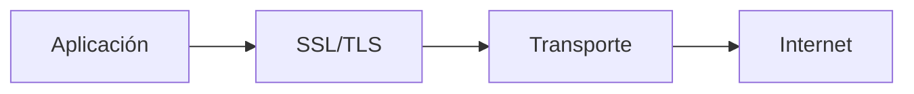

---

## Cómo funciona

### Idea clave

El cifrado ocurre antes de enviar los datos.

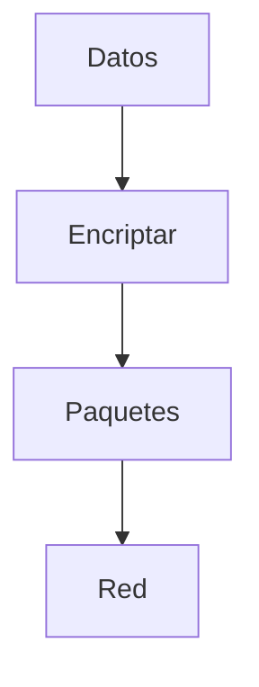

---

## Flujo completo

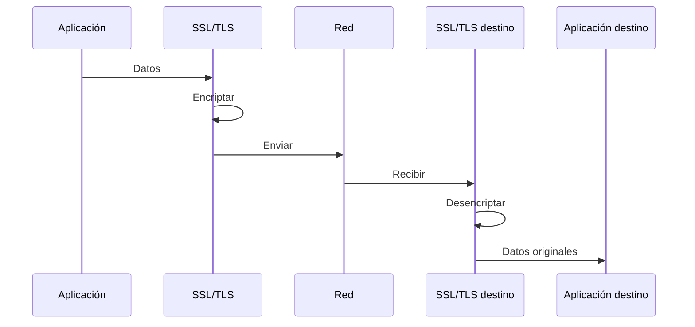

---

## Transparencia para la red

### Idea clave

Las capas inferiores no saben que los datos están cifrados.

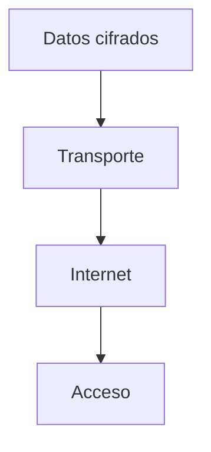

---

## Ventaja clave

### Idea clave

No fue necesario cambiar nada en la infraestructura.

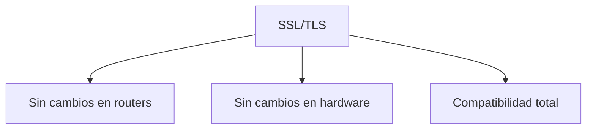

---

## Impacto en aplicaciones

### Idea clave

Las aplicaciones solo indican si quieren cifrado.

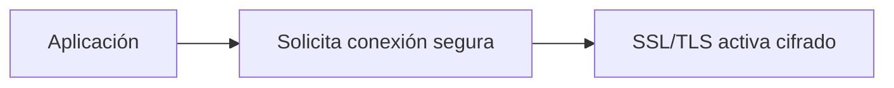

---

## Ejemplo real

### HTTP vs HTTPS

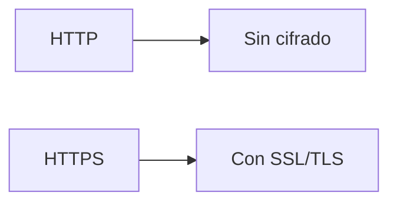

---

## Insight clave

### Idea clave

SSL/TLS es una “capa invisible” de seguridad.

- No rompe Internet
- No cambia protocolos base
- Añade seguridad de forma modular

---

## Por qué fue una solución brillante

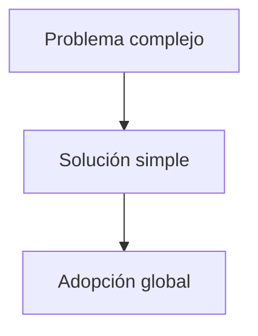

---

## Resumen

- Internet no fue diseñado con seguridad
- No era viable modificar su infraestructura
- Se creó SSL/TLS como capa adicional
- Se ubica entre Aplicación y Transporte
- Encripta datos antes de enviarlos
- Las capas inferiores no cambian
- No requiere cambios en routers ni hardware
- Las aplicaciones solo solicitan conexiones seguras
- Permite seguridad sin romper Internet