## Idea general

### Idea clave

El navegador puede usar conexiones cifradas o no cifradas.

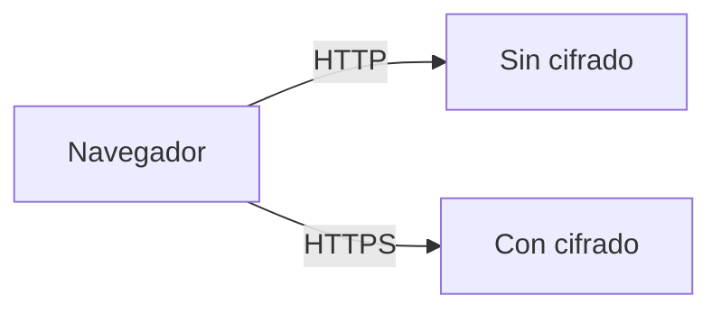

---

## Diferencia clave

### HTTP vs HTTPS

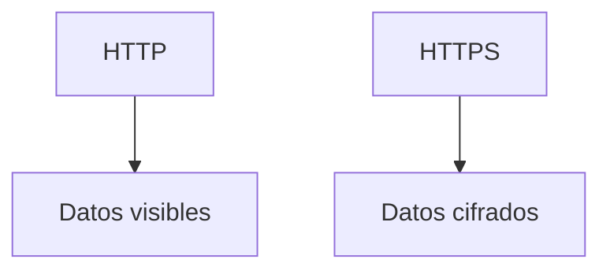

---

## Indicador visual

### Idea clave

El navegador muestra un candado cuando la conexión es segura.

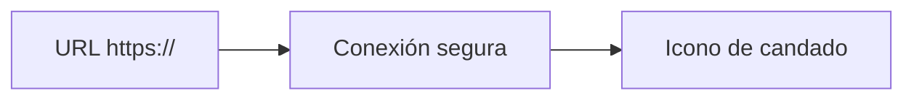

---

## Qué ocurre detrás

### Idea clave

HTTPS utiliza SSL/TLS para cifrar los datos.

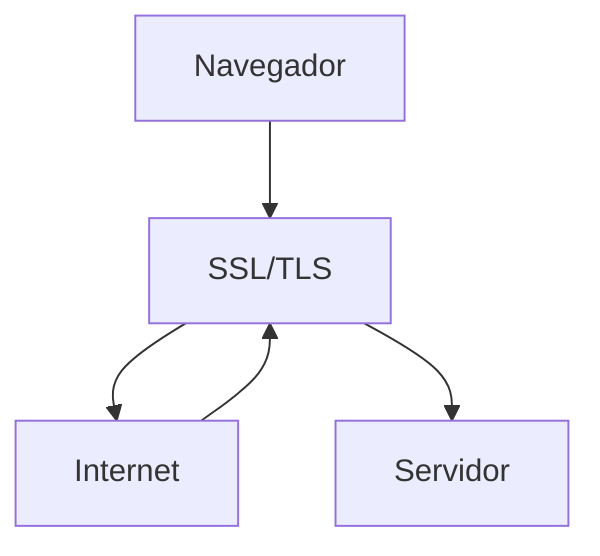

---

## Flujo de datos seguro

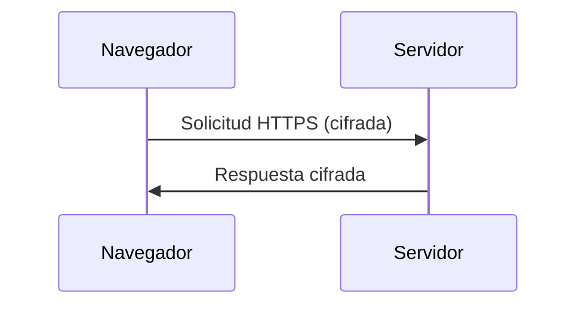

---

## Costo del cifrado

### Idea clave

Cifrar y descifrar consume recursos.

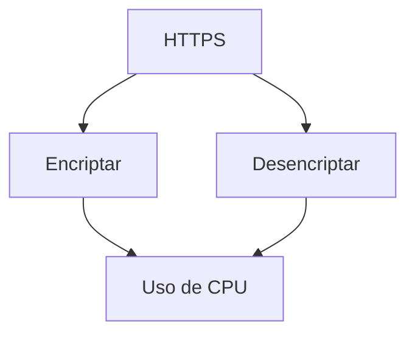

---

## Uso histórico

### Idea clave

Antes, HTTPS solo se usaba para datos sensibles.

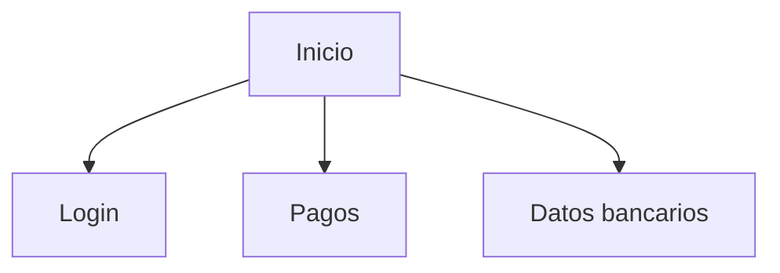

---

## Evolución

### Idea clave

Hoy casi todo el tráfico web es cifrado.

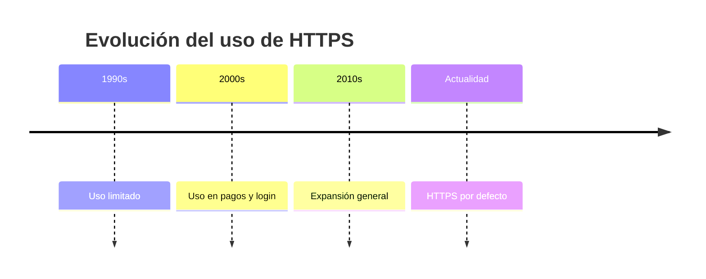

---

## Por qué cambió

### Razones

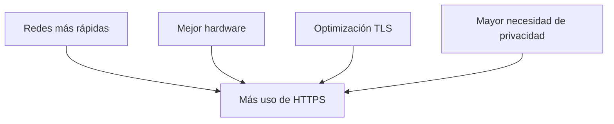

---

## Riesgo sin HTTPS

### Idea clave

Los datos pueden ser interceptados.

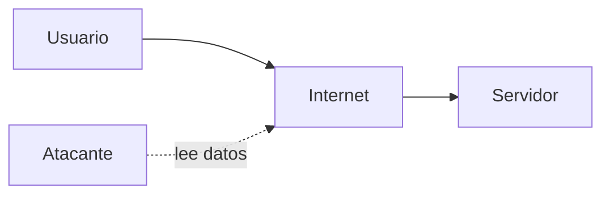

---

## Seguridad con HTTPS

### Idea clave

Los datos son ilegibles para terceros.

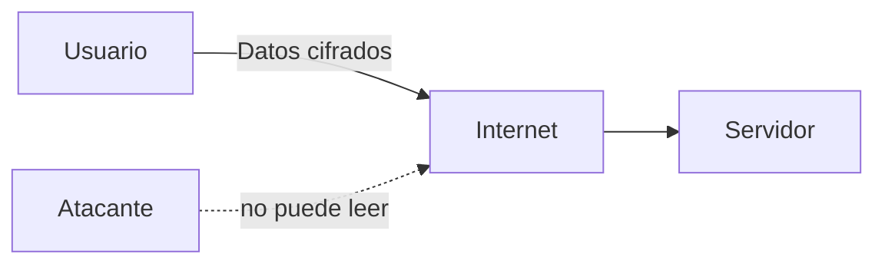

---

## Insight clave

### Idea clave

Hoy asumimos que TODO debe ir cifrado.

- No solo contraseñas
- También navegación normal
- Privacidad por defecto

---

## Resumen

- HTTP envía datos sin cifrar
- HTTPS usa SSL/TLS para cifrar
- El navegador muestra un candado como indicador
- El cifrado consume recursos, pero cada vez menos
- Antes se usaba solo para datos sensibles
- Hoy se usa prácticamente en todo el tráfico web
- HTTPS protege contra interceptación de datos