## Problema fundamental

### Idea clave

El cifrado no garantiza que estás hablando con el servidor correcto.

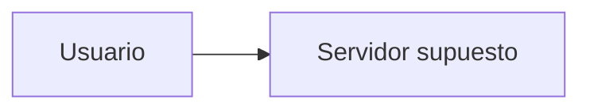

---

## Ataque posible

### Idea clave

Un atacante puede hacerse pasar por un servidor legítimo.

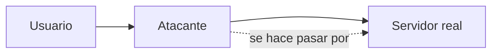

---

## Escenario de ataque

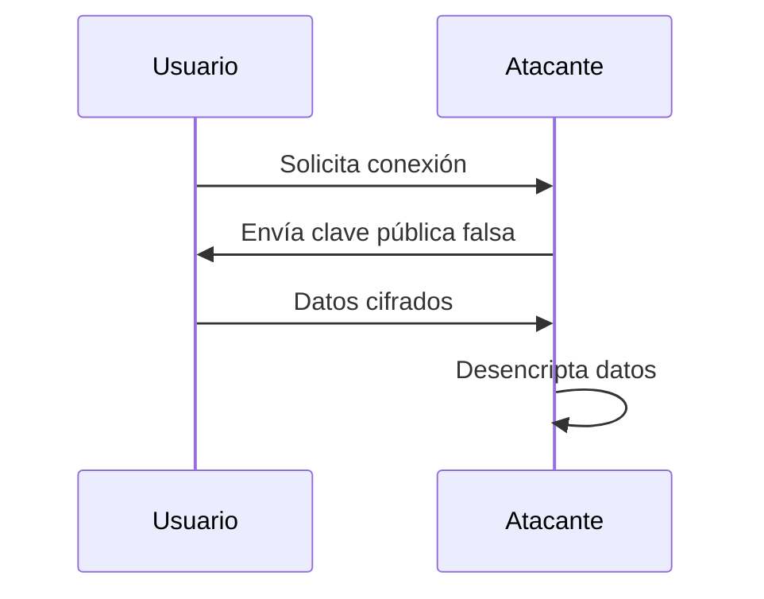

---

## Problema clave

### Idea clave

¿Cómo saber si una clave pública es legítima?

- No basta con recibir una clave
- Necesitamos verificar su origen

---

## Solución: certificados digitales

### Idea clave

Una clave pública viene acompañada de una firma confiable.

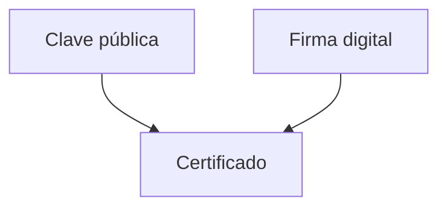

---

## Autoridades de Certificación (CA)

### Idea clave

Entidades confiables que validan identidades.

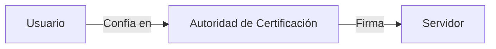

---

## Flujo de confianza

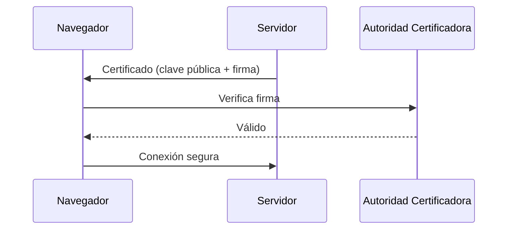

---

## Qué contiene un certificado

### Elementos

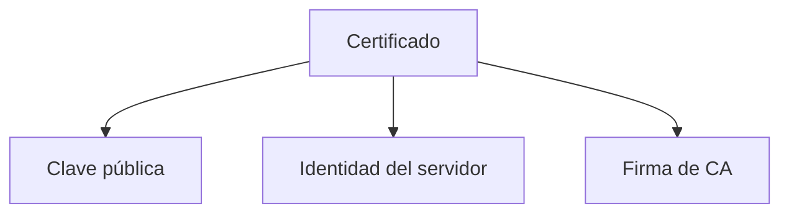

---

## Qué pasa si no es confiable

### Idea clave

El navegador advierte al usuario.

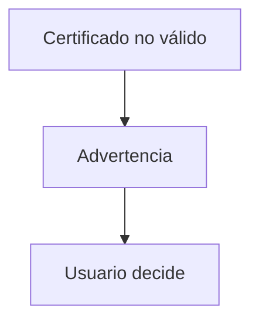

---

## Indicadores en navegador

### Idea clave

HTTPS + candado indican conexión verificada.

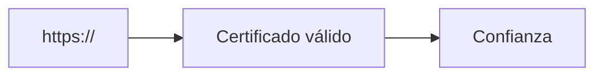

---

## Relación con SSL/TLS

### Idea clave

Los certificados funcionan dentro de SSL/TLS.

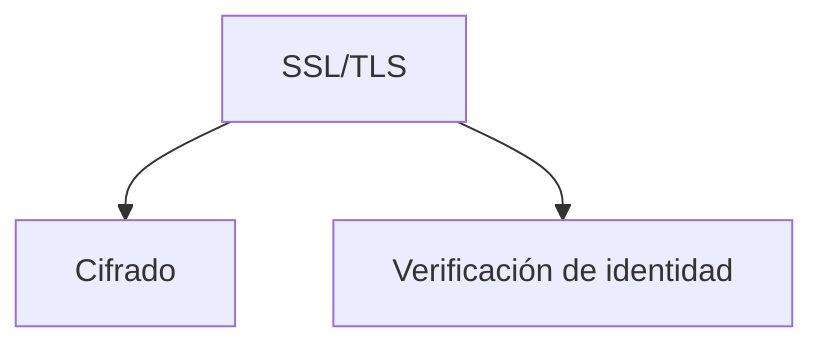

---

## Importancia en WiFi

### Idea clave

Protege incluso en redes inseguras.

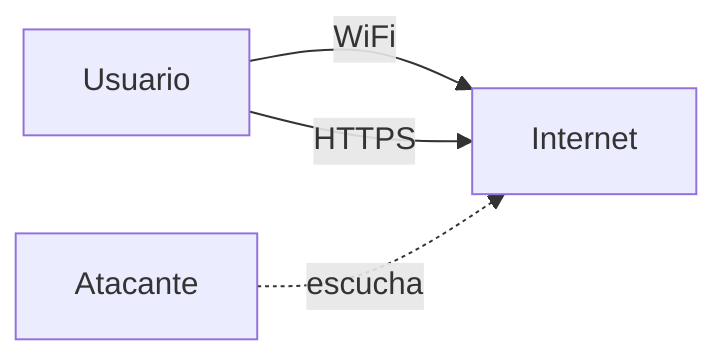

---

## Insight clave

### Idea clave

La seguridad no solo es cifrar… es confiar.

- Cifrado protege datos
- Certificados protegen identidad

---

## Resumen

- El cifrado no garantiza identidad
- Un atacante puede hacerse pasar por un servidor
- Los certificados validan la autenticidad
- Las Autoridades de Certificación (CA) firman claves
- Los navegadores confían en CAs preinstaladas
- Si un certificado no es válido, aparece advertencia
- HTTPS usa certificados + cifrado
- Esto permite comunicación segura a gran escala