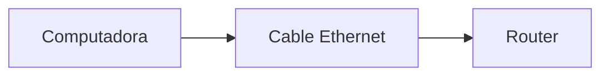
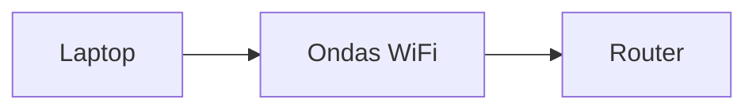

# Cómo viajan los datos físicamente

Hasta ahora hemos hablado de bits como 0 y 1.

Pero hay algo importante:

> los bits no existen físicamente como “0” y “1”
> 

Para viajar, los bits necesitan convertirse en algo real.

---

## La idea clave

Los datos viajan en forma de:

> **señales físicas que representan bits**
> 

Estas señales pueden ser:

- eléctricas
- electromagnéticas
- luminosas

---

## De bits a señales

Un dispositivo toma una secuencia de bits y la convierte en cambios físicos.

Por ejemplo:

- 1 → señal alta
- 0 → señal baja

---

---

## Tres formas principales de transmisión

### 1. Señales eléctricas (cables)

En cables como Ethernet:

- los datos viajan como variaciones de voltaje
- los bits se representan como cambios eléctricos

---

---

### 2. Ondas de radio (WiFi)

En redes inalámbricas:

- los datos viajan por el aire
- se usan ondas electromagnéticas

---

---

### 3. Luz (fibra óptica)

En conexiones de alta velocidad:

- los datos viajan como pulsos de luz
- la información se transmite a través de fibras

---

---

## ¿Qué significa “representar un bit”?

Un bit no es más que una diferencia en la señal.

Por ejemplo:

- cambio de voltaje
- cambio de frecuencia
- presencia o ausencia de luz

---

## Analogía útil

Imagina que quieres enviar mensajes con una linterna:

- luz encendida → 1
- luz apagada → 0

Si enciendes y apagas rápidamente, puedes enviar información.

Eso es exactamente lo que hace la fibra óptica, pero a gran velocidad.

---

## Algo importante: no es perfecto

Durante el viaje pueden ocurrir problemas:

- interferencia
- ruido
- pérdida de señal

Por eso las redes necesitan mecanismos para:

- detectar errores
- corregirlos

---

## Ejemplo real

Cuando ves un video en una aplicación como YouTube:

- los datos viajan como luz en cables submarinos
- luego como señales eléctricas
- luego como ondas WiFi hasta tu dispositivo

Todo esto ocurre continuamente.

---

## Intuición clave

Aunque hablamos de datos de forma abstracta:

> todo en redes es físico
> 

Los bits siempre se convierten en señales reales que viajan por algún medio.

---

## Idea clave de esta lección

Los datos no viajan como información abstracta, sino como señales físicas que representan bits.

---

## Repaso

- Los bits se convierten en señales físicas
- Existen tres medios principales:
    - eléctrico
    - inalámbrico
    - óptico
- Los bits son cambios en la señal
- La transmisión puede verse afectada por ruido o interferencia