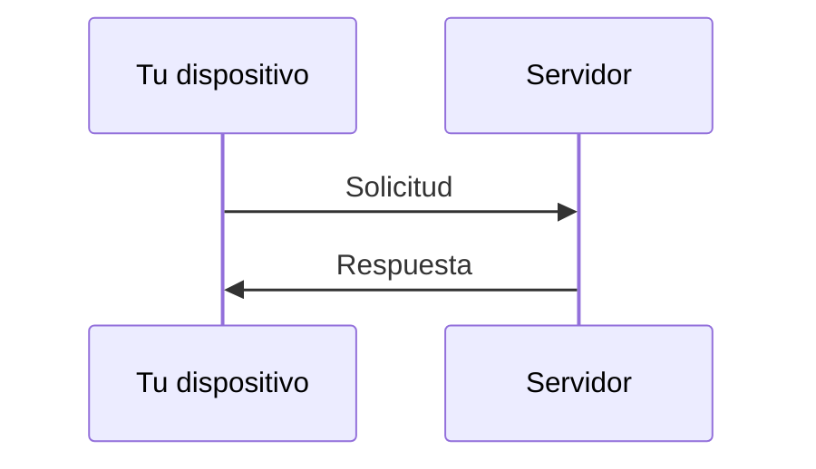

# Latencia y velocidad

Cuando usamos Internet, solemos decir cosas como:

- “mi internet está lento”
- “tengo buena velocidad”

Pero en realidad hay dos conceptos distintos involucrados:

> **latencia** y **velocidad (ancho de banda)**
> 

---

## La idea clave

- **Latencia** → cuánto tarda en llegar la información
- **Velocidad** → cuánta información puede enviarse por segundo

---

## Latencia: el tiempo de espera

La latencia es:

> el tiempo que tarda un dato en viajar desde el origen hasta el destino
> 

Se mide normalmente en milisegundos (ms).

---

### Ejemplo

Cuando haces clic en algo:

- pasa un pequeño tiempo antes de ver la respuesta

Ese retraso es la latencia.

---

El tiempo total de ida y vuelta es la latencia.

---

## ¿De qué depende la latencia?

- distancia física
- número de saltos (routers)
- tipo de conexión (WiFi vs cable)
- congestión de la red

---

## Velocidad (ancho de banda)

La velocidad en redes se refiere a:

> cuántos datos pueden transmitirse en un periodo de tiempo
> 

Se mide en:

- Mbps (megabits por segundo)
- Gbps (gigabits por segundo)

---

### Ejemplo

- 10 Mbps → menos datos por segundo
- 100 Mbps → más datos por segundo

---

## Analogía importante

Imagina una carretera:

- **latencia** → el tiempo que tarda un coche en llegar
- **velocidad (ancho de banda)** → cuántos coches pueden pasar al mismo tiempo

---

## Diferencia clave

Puedes tener:

- alta velocidad pero alta latencia
- baja velocidad pero baja latencia

Son cosas diferentes.

---

## Ejemplo real

En una aplicación como YouTube:

- la velocidad determina qué tan rápido carga el video
- la latencia afecta qué tan rápido responde cuando haces clic

---

## Otro ejemplo

En videojuegos en línea:

- la latencia es crítica
- aunque tengas alta velocidad, si la latencia es alta, el juego se siente lento

---

## Intuición clave

Velocidad no significa respuesta inmediata.

> puedes tener mucho “flujo de datos”, pero con retraso en la respuesta
> 

---

## Idea clave de esta lección

Latencia y velocidad son conceptos distintos:

- la latencia mide el tiempo de respuesta
- la velocidad mide la cantidad de datos transmitidos

Ambos afectan la experiencia en una red.

---

## Repaso

- Latencia = tiempo de viaje de los datos
- Velocidad = cantidad de datos por segundo
- Se miden de forma diferente
- Ambos influyen en cómo percibimos Internet